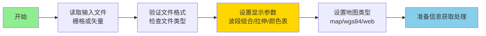
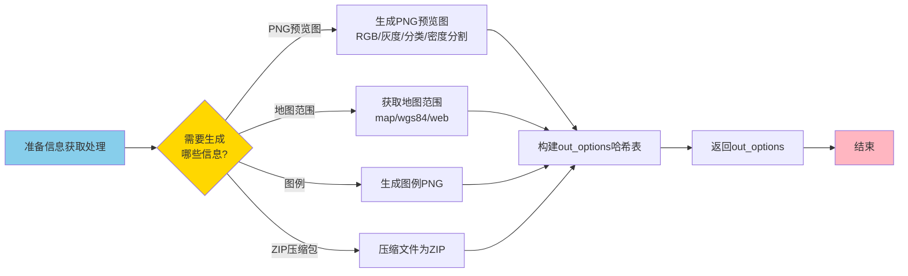
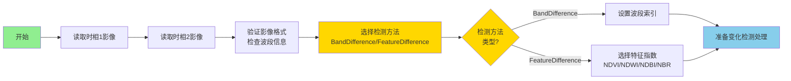
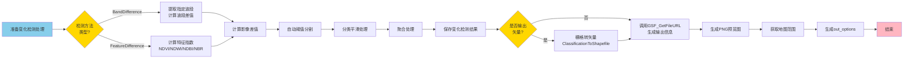

# 1月第一周工作计划（1.1-1.5）

## 项目选择

1. **项目1：GSF_GF1_GetFileURL**（GF1文件URL与信息获取）
2. **项目2：GSF_GF1_UnZip_Task**（GF1解压任务）
3. **项目3：GSF_GF1_Change_Detection**（GF1变化检测）

---

## 项目功能概述

### 项目1：GSF_GF1_GetFileURL

**主要功能**：
- **文件URL与信息获取**：对GF1-PMS数据进行文件URL与信息获取，生成预览图、地图范围、图例和ZIP压缩包等输出信息
- **多种显示方式**：支持RGB显示、灰度显示、分类显示、密度分割显示
- **多格式支持**：支持栅格和矢量文件输入
- **地图类型**：支持map（地图坐标）、wgs84（WGS84经纬度）、web（Web墨卡托）三种地图类型
- **输出信息**：可生成PNG预览图URL、地图范围、图例PNG URL、ZIP压缩包URL等

**应用场景**：
- GF1-PMS数据的预览图生成
- Web端数据展示和下载
- 数据范围信息提取
- 数据压缩打包

**技术特点**：
- 基于成熟的GSF_GetFileURL核心功能
- 针对GF1-PMS数据优化
- 支持多种显示方式和地图类型
- 自动生成标准化的输出信息

---

### 项目2：GSF_GF1_UnZip_Task

**主要功能**：
- **压缩文件解压**：对GF1-PMS压缩文件进行解压，支持ZIP、TAR、TAR.GZ格式
- **自动文件识别**：自动识别解压后的多光谱和全色文件
- **批量处理**：支持批量解压多个压缩文件
- **智能路径处理**：自动处理解压路径，支持单文件和多文件解压场景

**应用场景**：
- GF1-PMS原始数据解压
- 批量数据预处理
- 数据格式转换准备
- 自动化数据处理流程

**技术特点**：
- 支持多种压缩格式
- 自动识别GF1数据文件结构
- 智能路径管理
- 错误处理和日志记录

---

### 项目3：GSF_GF1_Change_Detection

**主要功能**：
- **变化检测**：对两个时相的GF1-PMS影像进行变化检测，识别地物变化区域
- **多种检测方法**：支持波段差值（BandDifference）和特征差值（FeatureDifference）两种方法
- **特征指数支持**：支持NDVI、NDWI、NDBI、NBR等特征指数进行变化检测
- **后处理功能**：支持平滑和聚合处理，提高检测结果质量
- **多格式输出**：支持输出栅格和矢量格式

**应用场景**：
- GF1-PMS数据的土地利用变化监测
- 植被覆盖变化分析
- 城市扩张监测
- 灾害变化评估

**技术特点**：
- 基于ENVI标准变化检测算法
- 支持多种检测方法
- 自动阈值分割和分类
- 可输出标准化的变化检测产品

---

# 项目1：GSF_GF1_GetFileURL

## 第一部分：任务框架与参数设置

### 流程图

### 对应任务说明

**1月1日（周一）- 项目1第1天**

#### 任务总体需求
- 完成GF1文件URL与信息获取任务的核心功能开发
- 实现参数设置和文件验证功能

#### 任务细分
1. 上午（3小时）
   - 分析GSF_GF1_GetFileURL.task参数结构
   - 设计主程序框架和参数验证逻辑
   - 实现GF1文件读取和格式验证

2. 下午（4小时）
   - 实现显示参数设置（波段组合、拉伸、颜色表）
   - 实现地图类型选择功能
   - 集成GSF_GetFileURL核心功能

#### 完成内容规划
- [ ] 完成.task文件参数定义验证
- [ ] 完成GF1文件读取和格式验证
- [ ] 完成参数设置框架搭建
- [ ] 完成GSF_GetFileURL功能集成
- [ ] 编写单元测试用例

---

## 第二部分：信息生成与结果输出

### 流程图

### 对应任务说明

**1月2日（周二）上午 - 项目1收尾（3小时）**

#### 任务总体需求
- 完成各种输出信息生成功能
- 实现完整的out_options构建

#### 任务细分
1. 信息生成实现（1.5小时）
   - 实现PNG预览图生成（支持多种显示方式）
   - 实现地图范围获取（支持多种坐标系）
   - 实现图例PNG生成
   - 实现ZIP压缩包生成

2. 集成测试（1.5小时）
   - 完成所有功能集成测试
   - 优化代码性能
   - 完善错误处理

#### 完成内容规划
- [ ] 完成PNG预览图生成功能
- [ ] 完成地图范围获取功能
- [ ] 完成图例和ZIP压缩包生成
- [ ] 完成out_options完整信息构建
- [ ] 完成项目1功能测试和文档

---

# 项目2：GSF_GF1_UnZip_Task

## 第一部分：文件识别与解压处理

### 流程图

### 对应任务说明

**1月2日（周二）下午 - 项目2开始（4小时）**

#### 任务总体需求
- 启动GF1解压任务项目，完成文件识别和解压处理

#### 任务细分
1. 项目分析和设计（2小时）
   - 分析GSF_GF1_UnZip_Task.task结构
   - 设计解压流程和文件识别逻辑
   - 设计GF1文件结构识别算法

2. 基础功能实现（2小时）
   - 实现压缩格式识别
   - 实现解压操作（ZIP/TAR/TAR.GZ）
   - 实现GF1文件自动识别（多光谱/全色）

#### 完成内容规划
- [ ] 完成项目2需求分析和设计文档
- [ ] 完成压缩格式识别模块
- [ ] 完成解压操作功能
- [ ] 完成GF1文件识别功能

---

## 第二部分：批量处理与结果输出

### 流程图

### 对应任务说明

**1月3日（周三）- 项目2第2天**

#### 任务总体需求
- 完成文件识别和批量处理功能
- 实现完整输出参数构建

#### 任务细分
1. 上午（3小时）
   - 实现GF1文件结构识别（多光谱/全色）
   - 实现解压文件列表构建
   - 实现输出参数设置

2. 下午（4小时）
   - 实现批量解压处理
   - 完善错误处理和日志
   - 优化代码性能

#### 完成内容规划
- [ ] 完成GF1文件识别算法
- [ ] 完成解压文件列表构建
- [ ] 完成批量处理功能
- [ ] 完成错误处理和日志记录
- [ ] 完成项目2功能测试和优化

---

# 项目3：GSF_GF1_Change_Detection

## 第一部分：数据读取与检测方法选择

### 流程图

### 对应任务说明

**1月4日（周四）- 项目3第1天**

#### 任务总体需求
- 启动GF1变化检测项目，完成数据读取和检测方法选择

#### 任务细分
1. 上午（3小时）
   - 分析GSF_GF1_Change_Detection.task复杂参数结构
   - 设计变化检测算法流程
   - 实现双时相影像读取和验证

2. 下午（4小时）
   - 实现检测方法选择框架
   - 实现波段差值方法
   - 实现特征差值方法（NDVI/NDWI/NDBI/NBR）

#### 完成内容规划
- [ ] 完成项目3需求分析和架构设计
- [ ] 完成双时相影像读取模块
- [ ] 完成检测方法选择功能
- [ ] 完成波段差值和特征差值框架

---

## 第二部分：变化检测与结果输出

### 流程图

### 对应任务说明

**1月5日（周五）上午 - 项目3收尾（3小时）**

#### 任务总体需求
- 完成变化检测核心算法和结果输出功能
- 实现完整输出信息生成

#### 任务细分
1. 变化检测算法实现（2小时）
   - 实现自动阈值分割功能
   - 实现分类平滑和聚合处理
   - 实现栅格转矢量功能（如需要）

2. 集成测试（1小时）
   - 完成所有功能集成测试
   - 优化代码性能
   - 完善错误处理

#### 完成内容规划
- [ ] 完成自动阈值分割功能
- [ ] 完成分类平滑和聚合处理
- [ ] 完成栅格转矢量功能
- [ ] 完成out_options完整信息生成
- [ ] 完成项目3功能测试

---

# 项目总结

## 1月5日（周五）下午 - 项目总结和文档整理（3小时）

### 任务总体需求
- 整理三个项目的代码和文档，编写总结报告

### 任务细分
1. 代码整理（1.5小时）
   - 代码审查和优化
   - 统一代码风格
   - 添加注释和文档字符串

2. 文档编写（1.5小时）
   - 更新项目文档
   - 编写使用说明
   - 编写总结报告

### 完成内容规划
- [ ] 完成所有项目代码整理
- [ ] 完成项目文档更新
- [ ] 完成使用说明编写
- [ ] 完成工作总结报告
- [ ] 准备项目演示材料

---

## 项目进度总览表

| 日期 | 项目 | 进度 | 主要交付物 |
|------|------|------|-----------|
| 1.1 | 项目1 | 60% | 任务框架、参数设置、文件验证 |
| 1.2上午 | 项目1 | 100% | 信息生成、输出信息构建、测试通过 |
| 1.2下午 | 项目2 | 30% | 文件识别、解压处理 |
| 1.3 | 项目2 | 100% | 批量处理、文件识别、测试通过 |
| 1.4 | 项目3 | 60% | 数据读取、检测方法选择 |
| 1.5上午 | 项目3 | 100% | 变化检测算法、测试通过 |
| 1.5下午 | 总结 | - | 文档、报告 |

---

## PPT使用建议

### 1. 每页布局
- **上半部分**：流程图
- **下半部分**：对应任务说明

### 2. 幻灯片结构建议
- **第1页**：封面
- **第2-3页**：项目1（第一部分+第二部分）
- **第4-5页**：项目2（第一部分+第二部分）
- **第6-7页**：项目3（第一部分+第二部分）
- **第8页**：项目进度总览表
- **第9页**：总结

### 3. 流程图截图方法
- 使用Mermaid在线编辑器：https://mermaid.live/
- 或使用支持Mermaid的工具（VS Code、Typora等）
- 导出为PNG格式，分辨率建议300dpi以上
- 确保流程图清晰可读，适合PPT展示

### 4. 注意事项
- 每日开始前回顾前一日进度，调整当日计划
- 每个功能模块完成后进行单元测试
- 遇到技术难点及时记录，统一解决
- 保持代码注释完整，便于后续维护
- 每日结束前提交代码，做好版本控制

---

## 时间分配总览

| 项目 | 总时长 | 分配日期 | 完成度 | 适用数据类型 |
|------|--------|----------|--------|-------------|
| 项目1 | 1.5天 | 1.1全天 + 1.2上午 | 100% | GF1-PMS栅格/矢量 |
| 项目2 | 1.5天 | 1.2下午 + 1.3全天 | 100% | GF1-PMS压缩文件 |
| 项目3 | 1.5天 | 1.4全天 + 1.5上午 | 100% | GF1-PMS双时相影像 |
| 总结 | 0.5天 | 1.5下午 | - | - |
| **总计** | **5天** | **1.1-1.5** | **3个项目** | **GF1-PMS数据** |

---

## 关键里程碑

- ✅ **1.1结束**：项目1核心功能完成（GF1文件URL与信息获取）
- ✅ **1.2上午结束**：项目1全部完成
- ✅ **1.2结束**：项目2基础框架完成（GF1解压任务）
- ✅ **1.3结束**：项目2全部完成
- ✅ **1.4结束**：项目3核心功能完成（GF1变化检测）
- ✅ **1.5上午结束**：项目3全部完成
- ✅ **1.5结束**：所有项目总结完成

---

## 数据适配说明

### GF1-PMS数据
- **适用项目**：所有三个项目
- **传感器类型**：GF1-PMS1、GF1-PMS2
- **处理流程**：
  - 项目1：数据读取 → 参数设置 → 信息生成 → 输出
  - 项目2：压缩文件识别 → 解压处理 → 文件识别 → 输出
  - 项目3：双时相读取 → 检测方法选择 → 变化检测 → 输出

### 数据格式要求
- **项目1**：支持ENVI、TIFF格式栅格，支持Shapefile矢量
- **项目2**：支持ZIP、TAR、TAR.GZ压缩格式
- **项目3**：支持ENVI、TIFF格式栅格，需经过辐射校正处理

### 数据质量要求
- **项目1**：数据需具有标准空间参考
- **项目2**：压缩文件需完整，包含GF1标准文件结构
- **项目3**：双时相影像需具有相同的空间参考和几何配准

---

*文档生成时间：2025年1月*

