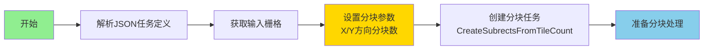
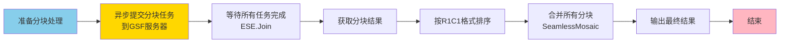
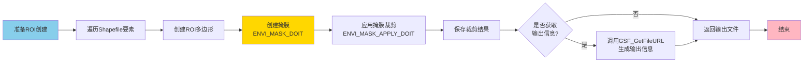
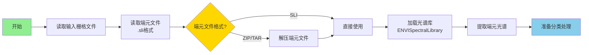
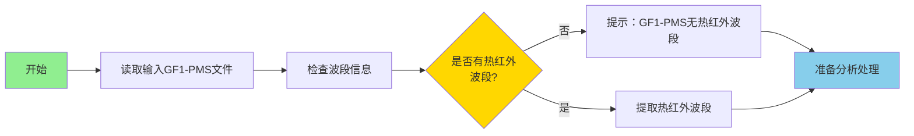

```mermaid
flowchart LR
    A[准备分类处理] --> B{是否掩膜云?}
    B -->|是| C[应用云掩膜]
    B -->|否| D[执行SAM分类<br/>ENVI_DOIT class_doit]
    C --> D
    D --> E[分类平滑处理<br/>ClassificationSmoothing]
    E --> F[分类聚合处理<br/>ClassificationAggregation]
    F --> G[保存分类结果]
    G --> H{是否输出<br/>矢量?}
    H -->|是| I[栅格转矢量<br/>ClassificationToShapefile]
    H -->|否| J[调用GSF_GetFileURL<br/>生成输出信息]
    I --> J
    J --> K[生成PNG预览图]
    K --> L[获取地图范围]
    L --> M[生成out_options]
    M --> N[结束]
    
    style A fill:#87CEEB
    style N fill:#FFB6C1
    style D fill:#FFD700
    style H fill:#FFD700
```

# 1月第二周工作计划（1.8-1.12）

## 项目选择

1. **项目1：GSF_GF1_Block_Processing**（GF1分块处理）
2. **项目2：GSF_GF1_RasterSubset_by_Shapefile**（GF1 Shapefile栅格裁剪）
3. **项目3：GSF_GF1_SAMClassfication**（GF1 SAM光谱角分类）
4. **项目4：GSF_GF1_UrbanHeatIsland**（GF1城市热岛分析）

---

## 项目功能概述

### 项目1：GSF_GF1_Block_Processing

**主要功能**：
- **分块处理**：对GF1-PMS大影像进行分块处理，将大影像分割为多个块进行并行处理
- **分布式处理**：支持通过GSF服务器进行分布式处理，提高大数据处理效率
- **自动合并**：自动合并所有分块的处理结果，生成完整的输出栅格
- **灵活配置**：支持自定义X方向和Y方向的分块数量

**应用场景**：
- GF1-PMS大影像的并行处理
- 大数据量影像的分布式计算
- 提高处理效率的批量任务

**技术特点**：
- 基于成熟的GSF_Block_Processing核心功能
- 针对GF1-PMS数据优化
- 支持异步任务提交和状态监控
- 自动按R1C1格式排序和合并分块结果

---

### 项目2：GSF_GF1_RasterSubset_by_Shapefile

**主要功能**：
- **栅格裁剪**：通过Shapefile矢量文件裁剪GF1-PMS栅格数据，提取感兴趣区域
- **自动投影转换**：自动处理栅格和矢量之间的投影坐标系转换
- **背景值处理**：支持自定义背景值，可保持原始数据的忽略值
- **多格式输出**：支持输出ENVI标准格式或TIFF格式

**应用场景**：
- GF1-PMS数据的区域提取
- 基于行政边界的数据裁剪
- 感兴趣区域（ROI）提取
- 批量区域数据处理

**技术特点**：
- 支持ZIP、TAR压缩格式的Shapefile输入
- 自动识别投影坐标系
- 支持多面要素的ROI创建
- 可生成预览图和地图范围信息

---

### 项目3：GSF_GF1_SAMClassfication

**主要功能**：
- **光谱角分类**：基于光谱角制图（SAM）算法对GF1-PMS影像进行分类
- **端元匹配**：使用端元光谱库进行匹配，识别不同地物类型
- **后处理功能**：支持平滑和聚合处理，提高分类结果质量
- **多格式输出**：支持输出分类栅格和矢量格式

**应用场景**：
- GF1-PMS数据的土地利用分类
- 地物类型识别
- 植被类型分类
- 水体、建筑等专题信息提取

**技术特点**：
- 基于ENVI标准SAM分类算法
- 支持云掩膜处理
- 可进行平滑和聚合后处理
- 支持输出分类栅格和Shapefile矢量

---

### 项目4：GSF_GF1_UrbanHeatIsland

**主要功能**：
- **热岛分析**：对GF1-PMS数据进行城市热岛效应分析
- **温度分布**：分析城市温度分布特征
- **热岛识别**：识别城市热岛区域
- **结果可视化**：生成热岛分布图和输出信息

**应用场景**：
- GF1-PMS数据的城市热岛监测
- 城市环境质量评估
- 热岛效应分析
- 城市规划辅助决策

**技术特点**：
- 基于GF1-PMS数据的热岛分析
- 注意：GF1-PMS数据不包含热红外波段，此任务为预留接口
- 实际应用中需要结合其他热红外数据源
- 可生成标准化的热岛分析产品

---

# 项目1：GSF_GF1_Block_Processing

## 第一部分：任务框架与参数设置

### 流程图

### 对应任务说明

**1月8日（周一）- 项目1第1天**

#### 任务总体需求
- 完成GF1分块处理任务的核心功能开发
- 实现参数设置和分块创建功能

#### 任务细分
1. 上午（3小时）
   - 分析GSF_GF1_Block_Processing.task参数结构
   - 设计主程序框架和参数验证逻辑
   - 实现JSON任务定义解析

2. 下午（4小时）
   - 实现分块参数设置（X/Y方向分块数）
   - 实现分块任务创建（CreateSubrectsFromTileCount）
   - 集成GSF服务器连接功能

#### 完成内容规划
- [ ] 完成.task文件参数定义验证
- [ ] 完成JSON任务定义解析
- [ ] 完成分块参数设置框架搭建
- [ ] 完成分块任务创建功能
- [ ] 编写单元测试用例

---

## 第二部分：分块处理与结果合并

### 流程图

### 对应任务说明

**1月9日（周二）上午 - 项目1收尾（3小时）**

#### 任务总体需求
- 完成分块处理执行和结果合并功能
- 实现完整的输出结果生成

#### 任务细分
1. 分块处理实现（1.5小时）
   - 实现异步任务提交到GSF服务器
   - 实现任务状态监控和等待
   - 实现分块结果获取

2. 结果合并实现（1.5小时）
   - 实现按R1C1格式排序分块栅格
   - 实现无缝拼接合并功能
   - 完成项目1功能测试和文档

#### 完成内容规划
- [ ] 完成异步任务提交功能
- [ ] 完成分块结果获取功能
- [ ] 完成分块排序和合并功能
- [ ] 完成项目1功能测试和文档

---

# 项目2：GSF_GF1_RasterSubset_by_Shapefile

## 第一部分：文件读取与投影转换

### 流程图

### 对应任务说明

**1月9日（周二）下午 - 项目2开始（4小时）**

#### 任务总体需求
- 启动GF1 Shapefile栅格裁剪项目，完成文件读取和投影转换

#### 任务细分
1. 项目分析和设计（2小时）
   - 分析GSF_GF1_RasterSubset_by_Shapefile.task结构
   - 设计裁剪流程和投影转换逻辑
   - 设计ROI创建算法

2. 基础功能实现（2小时）
   - 实现栅格和矢量文件读取
   - 实现投影信息获取和转换
   - 实现坐标转换功能

#### 完成内容规划
- [ ] 完成项目2需求分析和设计文档
- [ ] 完成文件读取模块
- [ ] 完成投影转换功能
- [ ] 完成坐标转换功能

---

## 第二部分：ROI创建与栅格裁剪

### 流程图

### 对应任务说明

**1月10日（周三）- 项目2第2天**

#### 任务总体需求
- 完成ROI创建和栅格裁剪功能
- 实现完整输出信息生成

#### 任务细分
1. 上午（3小时）
   - 实现ROI创建功能（支持多面要素）
   - 实现掩膜创建和应用
   - 实现栅格裁剪功能

2. 下午（4小时）
   - 实现输出文件保存（ENVI/TIFF格式）
   - 集成GSF_GetFileURL生成输出信息
   - 完善错误处理和日志

#### 完成内容规划
- [ ] 完成ROI创建算法
- [ ] 完成掩膜创建和应用功能
- [ ] 完成栅格裁剪功能
- [ ] 完成输出信息生成
- [ ] 完成项目2功能测试和优化

---

# 项目3：GSF_GF1_SAMClassfication

## 第一部分：数据读取与端元处理

### 流程图

### 对应任务说明

**1月11日（周四）- 项目3第1天**

#### 任务总体需求
- 启动GF1 SAM光谱角分类项目，完成数据读取和端元处理

#### 任务细分
1. 上午（3小时）
   - 分析GSF_GF1_SAMClassfication.task参数结构
   - 设计分类算法流程
   - 实现栅格和端元文件读取

2. 下午（4小时）
   - 实现端元文件解压（ZIP/TAR）
   - 实现光谱库加载和端元提取
   - 实现参数验证和默认值设置

#### 完成内容规划
- [ ] 完成项目3需求分析和架构设计
- [ ] 完成文件读取模块
- [ ] 完成端元处理功能
- [ ] 完成光谱库加载功能

---

## 第二部分：SAM分类与后处理

### 流程图

### 对应任务说明

**1月12日（周五）上午 - 项目3收尾（3小时）**

#### 任务总体需求
- 完成SAM分类核心算法和后处理功能
- 实现完整输出信息生成

#### 任务细分
1. SAM分类算法实现（2小时）
   - 实现SAM分类功能（光谱角计算）
   - 实现分类平滑和聚合处理
   - 实现栅格转矢量功能（如需要）

2. 集成测试（1小时）
   - 完成所有功能集成测试
   - 优化代码性能
   - 完善错误处理

#### 完成内容规划
- [ ] 完成SAM分类功能
- [ ] 完成分类平滑和聚合处理
- [ ] 完成栅格转矢量功能
- [ ] 完成out_options完整信息生成
- [ ] 完成项目3功能测试

---

# 项目4：GSF_GF1_UrbanHeatIsland

## 第一部分：数据读取与预处理

### 流程图

### 对应任务说明

**1月12日（周五）下午 - 项目4（3小时）**

#### 任务总体需求
- 完成GF1城市热岛分析任务的基础框架
- 实现数据读取和预处理功能

#### 任务细分
1. 项目分析和设计（1.5小时）
   - 分析GSF_GF1_UrbanHeatIsland.task结构
   - 设计热岛分析流程
   - 实现数据读取和波段检查

2. 基础功能实现（1.5小时）
   - 实现数据读取模块
   - 实现波段信息检查
   - 实现预留接口框架

#### 完成内容规划
- [ ] 完成项目4需求分析和架构设计
- [ ] 完成数据读取模块
- [ ] 完成波段检查功能
- [ ] 完成预留接口框架
- [ ] 编写说明文档（GF1-PMS无热红外波段）

---

## 项目总结

## 1月12日（周五）下午 - 项目总结和文档整理（1小时）

### 任务总体需求
- 整理四个项目的代码和文档，编写总结报告

### 任务细分
1. 代码整理（0.5小时）
   - 代码审查和优化
   - 统一代码风格
   - 添加注释和文档字符串

2. 文档编写（0.5小时）
   - 更新项目文档
   - 编写使用说明
   - 编写总结报告

### 完成内容规划
- [ ] 完成所有项目代码整理
- [ ] 完成项目文档更新
- [ ] 完成使用说明编写
- [ ] 完成工作总结报告
- [ ] 准备项目演示材料

---

## 项目进度总览表

| 日期 | 项目 | 进度 | 主要交付物 |
|------|------|------|-----------|
| 1.8 | 项目1 | 60% | 任务框架、参数设置、分块创建 |
| 1.9上午 | 项目1 | 100% | 分块处理、结果合并、测试通过 |
| 1.9下午 | 项目2 | 30% | 文件读取、投影转换 |
| 1.10 | 项目2 | 100% | ROI创建、栅格裁剪、测试通过 |
| 1.11 | 项目3 | 60% | 数据读取、端元处理 |
| 1.12上午 | 项目3 | 100% | SAM分类、后处理、测试通过 |
| 1.12下午 | 项目4 | 100% | 数据读取、预留接口、文档 |
| 1.12下午 | 总结 | - | 文档、报告 |

---

## PPT使用建议

### 1. 每页布局
- **上半部分**：流程图
- **下半部分**：对应任务说明

### 2. 幻灯片结构建议
- **第1页**：封面
- **第2-3页**：项目1（第一部分+第二部分）
- **第4-5页**：项目2（第一部分+第二部分）
- **第6-7页**：项目3（第一部分+第二部分）
- **第8页**：项目4（简化版，因为功能较简单）
- **第9页**：项目进度总览表
- **第10页**：总结

### 3. 流程图截图方法
- 使用Mermaid在线编辑器：https://mermaid.live/
- 或使用支持Mermaid的工具（VS Code、Typora等）
- 导出为PNG格式，分辨率建议300dpi以上
- 确保流程图清晰可读，适合PPT展示

### 4. 注意事项
- 每日开始前回顾前一日进度，调整当日计划
- 每个功能模块完成后进行单元测试
- 遇到技术难点及时记录，统一解决
- 保持代码注释完整，便于后续维护
- 每日结束前提交代码，做好版本控制

---

## 时间分配总览

| 项目 | 总时长 | 分配日期 | 完成度 | 适用数据类型 |
|------|--------|----------|--------|-------------|
| 项目1 | 1.5天 | 1.8全天 + 1.9上午 | 100% | GF1-PMS大影像 |
| 项目2 | 1.5天 | 1.9下午 + 1.10全天 | 100% | GF1-PMS栅格+Shapefile |
| 项目3 | 1.5天 | 1.11全天 + 1.12上午 | 100% | GF1-PMS栅格+端元文件 |
| 项目4 | 0.5天 | 1.12下午 | 100% | GF1-PMS栅格（预留接口） |
| 总结 | 0.5天 | 1.12下午 | - | - |
| **总计** | **5天** | **1.8-1.12** | **4个项目** | **GF1-PMS数据** |

---

## 关键里程碑

- ✅ **1.8结束**：项目1核心功能完成（GF1分块处理）
- ✅ **1.9上午结束**：项目1全部完成
- ✅ **1.9结束**：项目2基础框架完成（GF1 Shapefile栅格裁剪）
- ✅ **1.10结束**：项目2全部完成
- ✅ **1.11结束**：项目3核心功能完成（GF1 SAM光谱角分类）
- ✅ **1.12上午结束**：项目3全部完成
- ✅ **1.12下午结束**：项目4全部完成（GF1城市热岛分析）
- ✅ **1.12结束**：所有项目总结完成

---

## 数据适配说明

### GF1-PMS数据
- **适用项目**：所有四个项目
- **传感器类型**：GF1-PMS1、GF1-PMS2
- **处理流程**：
  - 项目1：数据读取 → 分块创建 → 并行处理 → 结果合并
  - 项目2：数据读取 → 投影转换 → ROI创建 → 栅格裁剪
  - 项目3：数据读取 → 端元处理 → SAM分类 → 后处理
  - 项目4：数据读取 → 波段检查 → 预留接口（无热红外波段）

### 数据格式要求
- **项目1**：支持ENVI、TIFF格式栅格，需为大影像
- **项目2**：支持ENVI、TIFF格式栅格，支持Shapefile矢量（可压缩）
- **项目3**：支持ENVI、TIFF格式栅格，支持.sli端元文件（可压缩）
- **项目4**：支持ENVI、TIFF格式栅格（注意：无热红外波段）

### 数据质量要求
- **项目1**：数据需具有标准空间参考，适合分块处理
- **项目2**：栅格和矢量需具有相同或可转换的投影坐标系
- **项目3**：数据需经过辐射校正处理，端元光谱需匹配
- **项目4**：数据需具有标准空间参考（注意：GF1-PMS无热红外波段）

---

*文档生成时间：2025年1月*

