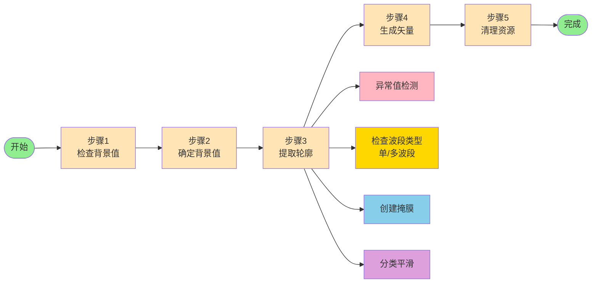

# 栅格轮廓提取工具 (Raster Footprint Extraction Tool)

## 项目概述

本项目实现了一个自定义的ENVI任务，用于从栅格影像中自动提取有效数据区域的轮廓，并输出为Shapefile矢量文件。该工具特别适用于处理高分一号（GF-1）等卫星影像数据，能够自动识别背景值并生成数据覆盖范围的矢量边界。

**核心特点**：
- ✅ **一键处理**：无需手动检查背景值，程序自动执行完整流程
- ✅ **智能检测**：自动检测NoData值并推荐合适的背景值
- ✅ **异常值检测**：自动检测全色融合后影像的异常值（如小于-125的值），确保轮廓完整
- ✅ **精确排除**：支持排除多个值范围（背景值、NoData值、异常值范围），精确控制轮廓边界
- ✅ **详细反馈**：显示每个处理步骤的详细信息和时间统计
- ✅ **稳定可靠**：完善的错误处理和资源管理机制

## 文件夹结构

```
test_1201footprint_envitask/
├── test_1201footprint_envitask.pro      # 核心处理程序（ENVI任务主程序）
│                                         # 已整合背景值检查、轮廓提取、矢量生成功能
├── test_1201footprint_envitask.task     # 任务定义文件（JSON格式）
│                                         # 定义任务参数和UI界面
├── test_1201footprint_envitask_ui.pro   # 图形界面程序
│                                         # 提供可视化的参数设置界面
├── README.txt                           # 使用说明文档（文本格式）
└── 1201_栅格轮廓提取工具使用说明.md     # 本文档（详细说明）
```

## 核心功能

### 1. 自动轮廓提取
- 从多波段栅格影像中提取有效数据区域的轮廓
- 自动识别并排除背景值（NoData值或指定背景值）
- 生成包含数据覆盖范围的矢量边界文件（Shapefile格式）

### 2. 智能背景值检测（已整合到主程序）
- **自动检测**：自动检测栅格元数据中的NoData值
- **统计分析**：自动分析各波段统计信息（采样前1000x1000像素）
- **智能推荐**：自动分析最常见值和边界最常见值，推荐合适的背景值
- **默认自动**：Background Value参数留空时，自动使用NoData值或推荐值
- **手动覆盖**：支持手动指定背景值（适用于特殊情况）
- **无需单独工具**：所有检查功能已整合，无需运行额外程序

### 3. 多波段处理
- 自动选择最后一个波段进行处理（通常包含更多信息）
- 支持多波段栅格数据（如GF-1的4波段多光谱数据）
- 自动验证数据有效性

### 4. 完善的进度反馈
- 实时显示每个处理步骤的进度
- 显示每个步骤的耗时统计
- 显示总处理时间
- 详细的诊断信息帮助排查问题

### 5. 资源管理
- 支持通过栅格对象或文件路径输入
- 自动创建输出目录
- 完整的资源清理机制，防止内存泄漏和ENVI无响应

## 技术实现

### 处理流程

程序执行时会自动执行以下5个步骤，每个步骤都会显示详细的进度信息和时间统计：

#### 流程图

```mermaid
flowchart TD
    Start([开始]) --> Init[初始化ENVI对象]
    Init --> CheckInput[检查输入参数]
    CheckInput --> Step1[步骤1: 检查栅格背景值]
    
    Step1 --> GetInfo[获取栅格基本信息<br/>尺寸、波段数、数据类型]
    GetInfo --> CheckNoData[检查元数据中的NoData值]
    CheckNoData --> SampleStats[采样各波段统计信息<br/>前1000x1000像素]
    SampleStats --> Analyze[分析最常见值和边界值]
    Analyze --> Recommend[显示背景值建议]
    Recommend --> Step2[步骤2: 确定背景值]
    
    Step2 --> CheckParam{Background Value<br/>参数是否指定?}
    CheckParam -->|留空/!NULL| AutoMode[自动检测模式]
    CheckParam -->|有值| ManualMode[手动指定模式]
    
    AutoMode --> CheckNoDataValid{NoData值<br/>是否有效?}
    CheckNoDataValid -->|有效| UseNoData[使用NoData值]
    CheckNoDataValid -->|无效| UseRecommended[使用推荐背景值]
    UseNoData --> Step3
    UseRecommended --> Step3
    ManualMode --> Step3[步骤3: 提取栅格轮廓]
    
    Step3 --> GetNumBands[获取波段数量<br/>numBands = Raster.NBANDS]
    GetNumBands --> SelectBand[选择最后一个波段]
    SelectBand --> SampleCenter[从中心区域采样验证]
    SampleCenter --> CheckDataType{检查数据类型}
    
    CheckDataType -->|有符号类型<br/>int/int16/int32| DetectAbnormal[异常值检测]
    CheckDataType -->|无符号类型<br/>uint| SkipAbnormal[跳过异常值检测]
    
    DetectAbnormal --> SampleMulti[采样多个区域<br/>检查所有波段]
    SampleMulti --> HasNegative{任一波段<br/>有负值?}
    HasNegative -->|是| SetAbnormal[设置异常值范围<br/>排除所有 < 0]
    HasNegative -->|否| NoAbnormal[未检测到异常值]
    SetAbnormal --> BuildExclude
    NoAbnormal --> BuildExclude
    SkipAbnormal --> BuildExclude
    
    BuildExclude[构建排除值列表] --> AddBackValue[添加背景值]
    AddBackValue --> CheckNoDataDiff{NoData值与<br/>背景值不同?}
    CheckNoDataDiff -->|是| AddNoData[添加NoData值]
    CheckNoDataDiff -->|否| CheckAbnormal
    AddNoData --> CheckAbnormal{检测到<br/>异常值?}
    CheckAbnormal -->|是| AddAbnormal[添加异常值范围<br/>-10000 到 -1]
    CheckAbnormal -->|否| CheckBandsType
    AddAbnormal --> CheckBandsType{检查波段数量<br/>单波段/多波段?}
    CheckBandsType --> BuildArray[构建2xN数组]
    BuildArray --> CreateMask
    
    CreateMask[使用ENVIDataValuesMaskRaster<br/>创建掩膜] --> VerifyMask[验证掩膜有效性]
    VerifyMask --> Classify[使用ColorSliceClassification<br/>创建分类栅格]
    Classify --> Smooth[对分类结果进行<br/>轻微平滑处理 3x3核]
    Smooth --> VerifyClass[验证分类结果]
    VerifyClass --> Step4[步骤4: 生成矢量文件]
    
    Step4 --> ConvertShape[使用ClassificationToShapefile<br/>转换为Shapefile]
    ConvertShape --> ExportROI[导出类别1 ROI]
    ExportROI --> SaveFile[保存到指定路径<br/>自动创建目录]
    SaveFile --> VerifySize[验证输出文件大小]
    VerifySize --> Step5[步骤5: 清理资源]
    
    Step5 --> CloseRasters[关闭所有栅格对象<br/>分类栅格、掩膜栅格、波段子集]
    CloseRasters --> ReleaseMem[释放内存]
    ReleaseMem --> End([处理完成])
    
    style Start fill:#90EE90
    style End fill:#90EE90
    style Step1 fill:#FFE4B5
    style Step2 fill:#FFE4B5
    style Step3 fill:#FFE4B5
    style Step4 fill:#FFE4B5
    style Step5 fill:#FFE4B5
    style DetectAbnormal fill:#FFB6C1
    style CreateMask fill:#87CEEB
    style Classify fill:#87CEEB
    style ConvertShape fill:#DDA0DD
```



#### 简化流程图（概览）



#### 步骤1：检查栅格背景值
- 显示栅格基本信息（尺寸、波段数、数据类型）
- 检查元数据中的NoData值
- 检查各波段统计信息（采样前1000x1000像素）
  - 最小值、最大值、平均值
  - 最常见值（可能是背景值）
  - 边界最常见值（边界通常是背景）
  - NoData值出现频率
- 显示背景值建议

**典型耗时**：0.08-0.10秒

#### 步骤2：确定背景值
- **自动检测模式**（推荐）：
  - 如果Background Value参数留空，自动使用检测到的NoData值
  - 如果没有NoData值，使用推荐的背景值（边界最常见值）
  - 如果都没有，使用默认值0
- **手动指定模式**：
  - 如果Background Value参数有值，使用指定的值
  - 但如果指定值为0且数据有NoData值，会智能提示并优先使用NoData值

**典型耗时**：< 0.01秒

#### 步骤3：提取栅格轮廓
- 自动选择最后一个波段（索引 = 总波段数 - 1）
- 从中心区域采样数据以验证有效性
- **异常值检测**（针对有符号数据类型）：
  - 检查所有波段，如果任一波段有负值，则视为异常
  - 对于全色融合后的影像，特别检测底部区域的异常值（如小于-125的值）
  - 如果检测到异常值，将排除所有 < 0 的值
  - 对于无符号数据类型（uint），跳过异常值检测

  **异常值检测详细流程**：
  
  ```mermaid
  flowchart TD
      Start[开始异常值检测] --> CheckType{检查数据类型}
      CheckType -->|有符号类型<br/>int/int16/int32| CheckStrategy[策略: 检查所有波段<br/>任一波段有负值则视为异常]
      CheckType -->|无符号类型<br/>uint/uint16/uint32| Skip[跳过异常值检测<br/>无符号类型无法有负值]
      
      CheckStrategy --> Sample[采样多个区域检查所有波段<br/>默认3个区域，每个1000x1000像素]
      Sample --> GetData[获取所有波段数据]
      GetData --> FindMin[对每个像素<br/>在所有波段中找最小值]
      FindMin --> CheckNegative{最小值 < 0?}
      
      CheckNegative -->|是| CountAbnormal[统计异常像素数<br/>记录异常值范围]
      CheckNegative -->|否| NoAbnormal[未检测到异常值]
      
      CountAbnormal --> CalcPercent[计算异常值百分比]
      CalcPercent --> HasAbnormal{检测到<br/>异常值?}
      
      HasAbnormal -->|是| SetRange[设置异常值排除范围<br/>从数据类型最小值到-1<br/>例如: -10000 到 -1]
      HasAbnormal -->|否| NoExclude[不排除异常值]
      
      SetRange --> End[结束异常值检测]
      NoAbnormal --> End
      NoExclude --> End
      Skip --> End
      
      style Start fill:#FFE4B5
      style End fill:#90EE90
      style CheckType fill:#FFB6C1
      style SetRange fill:#FF6347
      style Skip fill:#87CEEB
  ```
- **构建排除值列表**：
  - 总是排除背景值
  - 如果NoData值与背景值不同，也排除NoData值
  - 如果检测到异常值，排除所有负值范围（从数据类型最小值到-1）

  **排除值列表构建详细流程**：
  
  ```mermaid
  flowchart TD
      Start[开始构建排除值列表] --> Init["初始化数组<br/>minVals = 背景值<br/>maxVals = 背景值"]
      Init --> CheckNoData{是否有NoData值?}
      
      CheckNoData -->|是| CompareNoData{NoData值 !=<br/>背景值?}
      CheckNoData -->|否| CheckAbnormal1
      
      CompareNoData -->|是| AddNoData["扩展数组<br/>添加NoData值范围<br/>minVals = 背景值, NoData值<br/>maxVals = 背景值, NoData值"]
      CompareNoData -->|否| CheckAbnormal1{检测到<br/>异常值?}
      AddNoData --> CheckAbnormal1
      
      CheckAbnormal1 -->|是| GetDataType[获取数据类型<br/>确定最小值范围]
      CheckAbnormal1 -->|否| BuildArray
      
      GetDataType --> SetAbnormalRange["设置异常值范围<br/>int16: -32768 到 -1<br/>int32: -2147483648 到 -1<br/>其他: -10000 到 -1"]
      SetAbnormalRange --> AddAbnormal["扩展数组<br/>添加异常值范围<br/>minVals = ..., 异常最小值<br/>maxVals = ..., -1"]
      AddAbnormal --> BuildArray
      
      BuildArray["构建2xN数组<br/>excludeValues行0 = minVals<br/>excludeValues行1 = maxVals"] --> Verify[验证数组维度<br/>确保是2xN格式]
      Verify --> CheckBands{检查波段数量<br/>isSingleBand = numBands == 1?}
      
      CheckBands -->|单波段| UseKnown["使用已知numRanges值<br/>numRows = 2<br/>numCols = numRanges"]
      CheckBands -->|多波段| UseKnown2["使用已知numRanges值<br/>或SIZE方法作为备用"]
      
      UseKnown --> Validate[验证数组有效性<br/>检查维度是否正确]
      UseKnown2 --> Validate
      Validate --> End[排除值列表构建完成]
      
      style Start fill:#FFE4B5
      style End fill:#90EE90
      style Init fill:#87CEEB
      style AddNoData fill:#DDA0DD
      style AddAbnormal fill:#FF6347
      style BuildArray fill:#98FB98
  ```
- 使用 `ENVIDataValuesMaskRaster` 创建掩膜（支持排除多个值范围）
  - 精确排除背景值、NoData值和异常值
  - 使用2xN数组格式，每列表示一个[min, max]排除范围
- 使用 `ColorSliceClassification` 对掩膜进行分类
  - `NUMBER_OF_RANGES = 1`，输出类别0（背景）和类别1（ROI）
- 对分类结果进行轻微平滑处理（3x3核），使边界更整齐
- 验证分类结果，显示唯一类别值

**典型耗时**：5-10秒（取决于数据大小和异常值检测）

#### 步骤4：生成矢量文件
- 使用 `ClassificationToShapefile` 将分类结果转换为Shapefile
- 导出类别1（ROI）作为矢量轮廓
- 保存到指定路径（自动创建目录）
- 验证输出文件大小

**典型耗时**：10-15秒（取决于数据复杂度和轮廓形状）

#### 步骤5：清理资源
- 自动关闭所有中间栅格对象（分类栅格、掩膜栅格、波段子集）
- 释放内存，防止ENVI无响应
- 显示资源清理状态

**典型耗时**：< 0.02秒

### 关键技术点

- **对象管理**：支持栅格对象或文件路径两种输入方式，在任务内部打开文件，避免对象引用失效
- **错误处理**：使用 `CATCH` 块进行全面的错误捕获和处理，提供详细的错误信息
- **资源释放**：显式关闭所有栅格对象，防止内存泄漏
- **批处理优化**：不创建视图对象，不打开矢量文件，适合批处理场景
- **智能参数处理**：自动判断参数是否真正被指定，区分默认值和用户指定值
- **异常值检测**：
  - 针对有符号数据类型（int, int16, int32），自动检测所有波段的负值
  - 特别适用于全色融合后的影像，能检测底部区域的异常值（如小于-125的值）
  - 如果任一波段有负值，自动排除所有 < 0 的值，确保轮廓完整
- **精确掩膜创建**：
  - 使用 `ENVIDataValuesMaskRaster` 替代 `ENVIBinaryGTThresholdRaster`
  - 支持排除多个值范围（背景值、NoData值、异常值范围）
  - 使用2xN数组格式，每列表示一个[min, max]排除范围
- **维度获取优化**：
  - 单波段和多波段数据都优先使用已知的数组结构信息
  - SIZE方法作为备用，提高可靠性
- **分类平滑**：对分类结果进行轻微平滑处理，使生成的矢量边界更整齐

## 输入数据

### 数据格式
- **输入格式**：TIFF格式栅格文件（.tif），也支持其他ENVI支持的格式
- **数据类型**：支持多波段栅格数据
- **示例数据**：GF-1高分一号多光谱影像

### 数据要求
- 栅格数据应包含有效的NoData值或可识别的背景值
- 建议数据包含至少一个波段
- 数据应包含有效的非背景像素区域

### 示例输入文件
```
D:\FTPfiles\guangzhou\2024年\2024年第一季度\GF1原始像元值\
  GF1_PMS1_E113.3_N22.7_20240213_L1A13282365001_MSS.tif
```

**数据特征**：
- 格式：TIFF
- 尺寸：18948 x 20408 像素
- 波段数：4（多光谱）
- 数据类型：uint（无符号整数）
- NoData值：0
- 空间分辨率：根据GF-1传感器特性
- 覆盖范围：广州市区域

## 输出结果

### 输出格式
- **格式**：Shapefile（.shp）
- **坐标系**：与输入栅格数据相同
- **几何类型**：多边形（Polygon）

### 输出内容
- 矢量文件包含一个或多个多边形要素
- 每个多边形代表一个连续的有效数据区域
- 属性表包含类别信息（ROI）

### 示例输出文件
```
D:\FTPfiles\guangzhou\2024年\2024年第一季度\GF1处理\
  GF1_PMS1_E113.3_N22.7_20240213_L1A13282365001_MSS_footprint1201.shp
```

**输出特征**：
- 文件大小：约567 KB（示例数据）
- 包含完整的Shapefile文件组（.shp, .shx, .dbf, .prj）
- 可直接在GIS软件中打开和使用

## 使用方法

### 方法一：使用图形界面（推荐，最简单）

```idl
.compile test_1201footprint_envitask_ui
test_1201footprint_envitask_ui
```

**特点**：
- 可视化参数设置，操作简单直观
- 交互式文件选择，无需手动输入路径
- 实时显示处理进度和详细步骤信息
- 显示每个步骤的耗时统计
- 适合不熟悉代码的用户

**使用步骤**：
1. 在IDL命令行中编译并运行UI程序
2. 在弹出的对话框中：
   - **Input Raster**：选择输入栅格文件（推荐方式）
     - 可以从ENVI中已打开的数据列表中选择
     - 或通过浏览按钮选择TIFF文件
   - **Input File URI**：留空（如果已选择Input Raster）
     - 或者：如果不想先打开文件，可以在这里直接输入文件路径
   - **Background Value**：**留空（推荐）**
     - 留空时程序会自动检测NoData值
     - 只有在特殊情况下才需要手动指定
   - **Output Vector URI**：选择输出矢量文件路径
     - 可以浏览选择目录并输入文件名
     - 程序会自动添加.shp扩展名
3. 点击确定开始处理
4. 在控制台查看详细的处理进度和结果

**处理流程**：
- 自动执行5个步骤（检查背景值 → 确定背景值 → 提取轮廓 → 生成矢量 → 清理资源）
- 每个步骤都会显示详细的进度信息和时间统计
- 最后显示完整的处理时间统计表

### 方法二：直接调用任务程序（适合编程调用和批量处理）

```idl
.compile test_1201footprint_envitask

; 方式1：使用文件路径（推荐，避免对象引用问题）
test_1201Footprint_ENVITask, $
  input_file_uri='你的输入文件路径.tif', $
  Background_Value=!NULL, $  ; !NULL表示自动检测（推荐）
  output_vector_uri='你的输出文件路径.shp'

; 方式2：使用栅格对象
e = envi()
inputRaster = e.OpenRaster('你的输入文件路径.tif')
test_1201Footprint_ENVITask, $
  input_raster=inputRaster, $
  Background_Value=!NULL, $  ; !NULL表示自动检测
  output_vector_uri='你的输出文件路径.shp'
inputRaster.Close
```

**特点**：
- 适合在脚本中调用
- 支持批量处理多个文件
- 可以集成到其他工作流中
- 自动执行完整的处理流程（包括背景值检查）

## 参数说明

### 输入参数

| 参数名 | 类型 | 必需 | 默认值 | 说明 |
|--------|------|------|--------|------|
| `input_raster` | ENVIRaster | 否* | - | 输入栅格对象。可以从ENVI中已打开的数据选择 |
| `input_file_uri` | String | 否* | - | 输入文件路径（与input_raster二选一）。可以直接输入文件路径，无需先打开 |
| `Background_Value` | Double | 否 | 自动检测 | 背景值。**留空或!NULL表示自动检测NoData值（推荐）**。只有在特殊情况下才需要手动指定 |
| `output_vector_uri` | String | 是 | - | 输出矢量文件路径。程序会自动添加.shp扩展名 |

*注：`input_raster` 和 `input_file_uri` 至少提供一个，但不需要两个都提供。推荐使用 `input_raster`（在UI中选择文件）。

### 参数选择建议

**Input Raster vs Input File URI**：
- **推荐使用 Input Raster**：
  - 在UI中直接选择文件，操作简单
  - ENVI会自动处理文件打开和对象管理
  - 适合交互式使用
- **使用 Input File URI**：
  - 如果不想先打开文件
  - 适合批量处理脚本
  - 程序内部会自动打开文件

**Background Value**：
- **推荐：留空（自动检测）**
  - 程序会自动检测NoData值
  - 如果没有NoData值，会使用推荐的背景值
  - 适用于大多数情况
- **手动指定**：
  - 只有在自动检测失败或需要特殊背景值时才使用
  - 例如：数据没有NoData值，且背景值不是0

### 输出参数

| 参数名 | 类型 | 说明 |
|--------|------|------|
| 输出文件 | Shapefile | 包含数据轮廓的矢量文件，包含完整的.shp, .shx, .dbf, .prj文件组 |

## 处理示例

### 实际运行输出示例

```
==========================================
栅格轮廓提取工具 - 图形界面
==========================================

正在初始化ENVI...
ENVI初始化完成

正在加载任务配置文件...
任务配置加载完成

==========================================
请在弹出的对话框中设置参数:
  1. 选择输入栅格文件
  2. 设置背景值（可选，留空则自动检测）
  3. 选择输出矢量文件路径
  4. 点击确定开始处理
==========================================

正在打开参数设置对话框...
参数设置完成

==========================================
开始执行处理任务...
==========================================

开始时间: Mon Dec 01 15:57:18 2025

>>> 开始执行任务，详细进度如下:
------------------------------------------

==========================================
>>> 任务开始执行 <<<
==========================================
时间: Mon Dec 01 15:57:18 2025

正在初始化ENVI对象...
ENVI对象初始化完成

正在检查输入参数...
先检查 input_raster 参数...
input_raster 已提供（栅格对象）
使用栅格对象模式，跳过文件URI检查
>>> 将使用栅格对象模式处理

正在处理输出文件路径...
输出文件路径: D:\...\GF1_PMS1_E113.3_N22.7_20240213_L1A13282365001_MSS_footprint1201.shp

==========================================
步骤1: 检查栅格背景值
==========================================
开始时间: Mon Dec 01 15:57:18 2025

栅格信息:
  尺寸: 18948 x 20408
  波段数: 4
  数据类型: uint

元数据中的NoData值: 0

波段统计信息（采样前1000x1000像素，用于推荐背景值）:
  波段 1:
    最小值: 0, 最大值: 0, 平均值: 0.00
    最常见值: 0 (出现 1000000 次)
    边界最常见值: 0 (出现 4000 次)
    NoData值(0)出现: 1000000 次 (100.00%)
  ...（其他波段类似）

==========================================
背景值建议:
==========================================
1. 推荐使用NoData值作为背景值: 0

步骤1完成，耗时: 0.10 秒

==========================================
步骤2: 确定背景值
==========================================
开始时间: Mon Dec 01 15:57:19 2025

自动检测模式: 使用NoData值作为背景值: 0

步骤2完成，耗时: 0.00 秒

==========================================
步骤3: 提取栅格轮廓
==========================================
开始时间: Mon Dec 01 15:57:19 2025

使用波段 3 (共 4 个波段)
中心区域采样统计:
  总像素数: 1000000
  有效像素数（不等于背景值）: 1000000

正在创建掩膜（排除背景值: 0）...
原始波段数据范围（中心采样）: 938 到 4964
原始波段非零像素数（中心采样）: 10000

正在检测异常值（多波段检查）...
  策略: 检查所有波段，只要任一波段有负值就视为异常，排除所有 < 0 的值
  采样多个区域检查所有波段...
    采样区域 1: 行 0-999, 列 0-999
    采样区域 2: 行 6420-7419, 列 11900-12899
    采样区域 3: 行 12841-13840, 列 4544-5543
  ✓ 检测到异常值（任一波段有负值）:
    异常像素数: 4000 (占采样区域的 0.13%)
    异常值范围: -147 到 -107
    将排除所有 < 0 的值

正在准备排除值列表...
  背景值: -125
  NoData值: 0
  排除值范围:
    范围 1: [-125.000, -125.000]
    范围 2: [0.00000, 0.00000]
    范围 3: [-10000.0, -1.00000]

正在创建掩膜...
  排除值数组维度: 2 x 3 (行 x 列)
  排除值数量（列数）: 3
  ✓ 掩膜创建完成
掩膜已创建: 已排除背景值 -125
         已排除NoData值 0
         已排除异常值范围（所有 < 0 的值，因为任一波段有负值）
掩膜验证（中心采样）:
  总像素数: 10000
  有效像素数（未掩膜）: 10000

正在从掩膜创建分类栅格...
正在对分类结果进行轻微平滑处理（使边界更整齐）...
  ✓ 分类平滑完成
分类结果 - 唯一类别值（采样）: 0 1
类别值范围: 0 到 1
ROI类别值: 1
ROI类别像素数（采样）: 10000

步骤3完成，耗时: 5.22 秒

==========================================
步骤4: 生成矢量文件
==========================================
开始时间: Mon Dec 01 15:57:24 2025

正在生成矢量文件: D:\...\GF1_PMS1_E113.3_N22.7_20240213_L1A13282365001_MSS_footprint1201.shp
矢量文件创建成功! 文件大小: 567420 字节
输出文件: D:\...\GF1_PMS1_E113.3_N22.7_20240213_L1A13282365001_MSS_footprint1201.shp

步骤4完成，耗时: 12.26 秒

==========================================
步骤5: 清理资源
==========================================
开始时间: Mon Dec 01 15:57:36 2025

正在清理资源...
已关闭分类栅格
已关闭掩膜栅格
已关闭波段子集
资源清理完成

步骤5完成，耗时: 0.02 秒

==========================================
处理完成!
==========================================
输入文件: D:\...\GF1_PMS1_E113.3_N22.7_20240213_L1A13282365001_MSS.tif
输出文件: D:\...\GF1_PMS1_E113.3_N22.7_20240213_L1A13282365001_MSS_footprint1201.shp
使用的背景值: 0

处理时间统计:
  步骤1 (检查背景值): 0.10 秒
  步骤2 (确定背景值): 0.00 秒
  步骤3 (提取轮廓): 5.22 秒
  步骤4 (生成矢量): 12.26 秒
  步骤5 (清理资源): 0.02 秒
  总耗时: 17.60 秒
==========================================
```

## 常见问题

### 1. 矢量文件为空（no records）

**原因**：背景值设置不正确，导致所有像素都被识别为背景。

**解决方法**：
1. **查看处理过程中的"步骤1：检查栅格背景值"输出**，程序会自动检查并显示背景值建议
2. 在UI对话框中，将 **Background Value 留空**，让程序自动检测（推荐）
3. 如果自动检测失败，根据"背景值建议"部分，手动设置合适的背景值
4. 检查数据是否真的包含有效像素区域

### 2. ENVI无响应

**原因**：资源未正确释放（已在新版本中修复）。

**解决方法**：
- 新版本已修复：移除了视图对象获取，不打开矢量文件
- 自动关闭所有栅格对象
- 如果仍出现无响应，检查是否有其他程序占用资源或数据文件损坏

### 3. 处理速度慢

**原因**：处理大文件需要时间，这是正常现象。

**说明**：
- 程序会显示详细的处理进度信息和每个步骤的耗时
- 处理时间取决于数据大小和复杂度
- 典型处理时间：小文件（< 5000x5000）约10-20秒，大文件（> 10000x10000）可能需要1-5分钟
- 最耗时的步骤通常是"生成矢量文件"（步骤4），这是正常现象

### 4. 分类结果显示太多重复值

**原因**：这是显示优化问题，已在新版本中修复。

**说明**：
- 新版本会智能显示唯一类别值
- 如果唯一值超过10个，只显示前10个，避免输出过长
- 实际处理不受影响

### 5. 输出中有乱码

**原因**：IDL控制台的编码问题，不影响功能。

**说明**：
- 某些中文字符可能在IDL控制台中显示为乱码
- 这不会影响程序功能
- 输出文件路径和结果都是正确的
- 可以在GIS软件中打开生成的矢量文件验证结果

## 技术改进

### 版本优化历史

1. **整合背景值检查功能**：背景值检查已整合到主程序中，自动执行，无需单独运行检查工具
2. **自动NoData检测**：如果Background Value留空，自动使用栅格的NoData值或推荐值
3. **智能背景值推荐**：自动分析各波段统计信息，推荐合适的背景值
4. **智能参数判断**：自动区分"用户指定值"和"默认值"，如果指定值为0但数据有NoData值，优先使用NoData值
5. **智能波段选择**：使用最后一个波段（通常包含更多信息）
6. **详细进度反馈**：处理过程中显示详细统计信息、处理步骤和时间统计
7. **错误检查**：检查掩膜和分类结果，提前发现并报告问题
8. **资源管理**：完善的资源清理机制，防止内存泄漏
9. **批处理优化**：支持文件路径输入，避免对象引用问题
10. **UI优化**：添加详细的进度提示和时间统计，避免用户误以为程序卡死
11. **异常值检测**（v2.1新增）：
    - 针对有符号数据类型，自动检测所有波段的负值
    - 特别适用于全色融合后的影像，能检测底部区域的异常值（如小于-125的值）
    - 如果任一波段有负值，自动排除所有 < 0 的值，确保轮廓完整
    - 对于无符号数据类型，智能跳过异常值检测
12. **精确掩膜创建**（v2.1新增）：
    - 使用 `ENVIDataValuesMaskRaster` 替代 `ENVIBinaryGTThresholdRaster`
    - 支持排除多个值范围（背景值、NoData值、异常值范围）
    - 使用2xN数组格式，精确控制排除范围
13. **维度获取优化**（v2.1新增）：
    - 单波段和多波段数据都优先使用已知的数组结构信息
    - SIZE方法作为备用，提高可靠性，解决单波段uint数据的维度获取问题
14. **分类平滑**（v2.1新增）：
    - 对分类结果进行轻微平滑处理（3x3核），使生成的矢量边界更整齐

### 关键修复

- ✅ 修复了对象引用失效问题（通过文件路径输入）
- ✅ 修复了ENVI无响应问题（移除视图对象，不打开矢量文件）
- ✅ 修复了参数冲突问题（重命名参数避免歧义）
- ✅ 修复了资源泄漏问题（显式关闭所有对象）
- ✅ 修复了参数检查卡死问题（优化参数访问逻辑）
- ✅ 修复了分类结果显示问题（优化唯一值显示）
- ✅ 优化了Background Value默认行为（真正默认自动检测）
- ✅ 修复了单波段uint数据的维度获取问题（使用已知数组结构）
- ✅ 修复了多波段数据的维度获取问题（统一使用已知数组结构）
- ✅ 修复了全色融合影像底部异常值未排除的问题（异常值检测）
- ✅ 优化了掩膜创建逻辑（使用ENVIDataValuesMaskRaster支持多值范围排除）

## 应用场景

1. **卫星影像数据管理**：快速生成数据覆盖范围的矢量边界，用于数据管理和质量控制
2. **数据质量检查**：识别有效数据区域，检查数据完整性，发现数据缺失或异常
3. **批量处理**：自动化处理大量影像文件，生成批量数据的覆盖范围边界
4. **GIS数据准备**：为GIS分析准备数据范围边界，用于后续的空间分析和制图
5. **全色融合影像处理**：特别适用于全色融合后的影像，自动检测并排除底部区域的异常值（如小于-125的值），确保轮廓完整

## 依赖环境

- **ENVI**：需要ENVI软件环境（5.3或更高版本）
- **IDL**：需要IDL编程环境
- **ENVI Tasks**：使用ENVI任务框架

## 注意事项

1. **确保输出目录存在或有写入权限**
2. **Background Value设置建议**：
   - **推荐**：在UI中留空，让程序自动检测NoData值
   - 如果数据有NoData值，程序会自动使用
   - 如果数据背景为0且没有NoData值，程序会智能判断
   - 只有在特殊情况下才需要手动指定背景值
3. **输出文件会自动添加 .shp 扩展名**
4. **处理大文件时可能需要较长时间**，请耐心等待，程序会显示详细的进度信息
5. **程序会自动检查背景值**，无需手动运行检查工具
6. **查看处理输出**：程序会显示详细的处理步骤、统计信息和时间，帮助了解处理过程
7. **Input Raster 和 Input File URI**：只需要选择一个，推荐使用Input Raster（在UI中选择文件）
8. **异常值检测**：
   - 对于有符号数据类型（int, int16, int32），程序会自动检测所有波段的负值
   - 如果检测到异常值，会自动排除所有 < 0 的值，确保轮廓完整
   - 特别适用于全色融合后的影像，能自动处理底部区域的异常值（如小于-125的值）
   - 对于无符号数据类型（uint），程序会智能跳过异常值检测
9. **掩膜创建**：程序使用 `ENVIDataValuesMaskRaster` 精确排除多个值范围，包括背景值、NoData值和异常值范围

## 文件说明

### test_1201footprint_envitask.pro
核心处理程序，实现栅格轮廓提取的主要逻辑。包含：
- 背景值检查和分析
- 栅格轮廓提取
- 矢量文件生成
- 资源管理和清理
- 详细的进度反馈和时间统计

### test_1201footprint_envitask.task
ENVI任务定义文件，定义任务的参数和元数据。配置了：
- Input Raster（可选）
- Input File URI（可选）
- Background Value（可选，默认自动检测）
- Output Vector URI（必需）

### test_1201footprint_envitask_ui.pro
图形界面程序，提供可视化的参数设置界面。包含：
- 详细的启动提示
- 参数设置指导
- 处理进度提示
- 时间统计显示

### README.txt
使用说明文档（文本格式），提供快速参考。

### 1201_栅格轮廓提取工具使用说明.md
本文档，提供详细的使用说明和技术文档。

## 总结

本工具成功实现了从栅格影像中自动提取有效数据区域轮廓的功能，特别适用于高分一号等卫星影像数据的处理。通过**整合的背景值检查功能**、自动NoData值检测、异常值检测、智能参数判断、详细的进度反馈和完整的资源管理，工具能够稳定、高效地处理大量数据，生成准确的矢量轮廓文件，为后续的GIS分析和数据管理提供支持。

**核心优势**：
- ✅ **一键处理**：无需手动检查背景值，程序自动执行完整流程
- ✅ **智能检测**：自动检测NoData值并推荐合适的背景值
- ✅ **异常值检测**：自动检测全色融合后影像的异常值（如小于-125的值），确保轮廓完整
- ✅ **精确排除**：支持排除多个值范围（背景值、NoData值、异常值范围），精确控制轮廓边界
- ✅ **详细反馈**：显示每个处理步骤的详细信息和时间统计，便于诊断问题
- ✅ **稳定可靠**：完善的错误处理和资源管理机制，解决单波段和多波段数据的维度获取问题
- ✅ **用户友好**：图形界面操作简单，实时显示处理进度

**典型处理性能**：
- 小文件（< 5000x5000像素）：10-20秒
- 中等文件（5000-10000像素）：20-60秒
- 大文件（> 10000像素）：1-5分钟

---

**版本**：2.1  
**最后更新**：2024年12月  
**作者**：基于BuildFootprintTask改进

### v2.1 新特性

- **异常值检测**：自动检测全色融合后影像的异常值（如小于-125的值），确保轮廓完整
- **精确掩膜创建**：使用 `ENVIDataValuesMaskRaster` 支持排除多个值范围
- **维度获取优化**：解决单波段和多波段数据的维度获取问题
- **分类平滑**：对分类结果进行轻微平滑，使矢量边界更整齐
