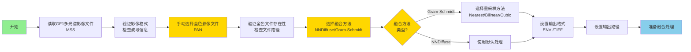
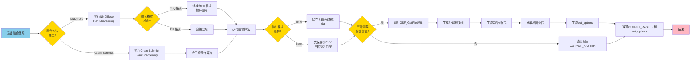

# GSF_GF1_PanSharpening 项目介绍

## 项目功能概述

### 项目1：GSF_GF1_PanSharpening（GF1全色+多光谱融合）

**主要功能**：
- **全色融合**：对GF1-PMS卫星影像进行全色与多光谱融合处理，将高分辨率全色影像的空间细节与多光谱影像的光谱信息相结合，生成高分辨率多光谱影像
- **多种融合方法**：支持NNDiffuse Pan Sharpening（推荐）和Gram-Schmidt Pan Sharpening两种融合算法，满足不同应用需求
- **灵活重采样**：支持Nearest Neighbor、Bilinear（推荐）、Cubic Convolution三种重采样方法，平衡处理精度与效率
- **手动文件选择**：提供交互式文件选择对话框，用户可手动选择对应的全色影像文件，确保数据匹配准确性
- **多格式输出**：支持ENVI和TIFF两种输出格式，满足不同后续处理需求
- **自动输出信息**：自动生成PNG预览图、ZIP压缩包、地图范围等输出信息，便于Web端展示与下载

**应用场景**：
- GF1-PMS数据的全色+多光谱融合处理
- 高分辨率多光谱影像产品生产
- 地物识别和分类精度提升
- 定量遥感分析和参数提取
- 多时相影像对比分析

**技术特点**：
- 基于ENVI成熟的NNDiffuse和Gram-Schmidt融合算法
- 支持BSQ格式自动转换为BIL格式，提升处理效率
- 智能处理Data Ignore Value，支持多波段独立设置
- 完善的错误处理机制，确保处理稳定性
- 自动生成输出信息（预览图、ZIP、地图范围等）

---

## 第一部分：数据准备与参数设置

### 流程图

### 对应任务说明

**数据准备阶段**

#### 任务总体需求
- 完成GF1全色+多光谱融合任务的数据准备和参数配置
- 实现交互式文件选择和参数设置功能

#### 任务细分
1. 数据读取与验证（1小时）
   - 实现GF1多光谱影像文件读取
   - 实现影像格式和波段信息验证
   - 实现全色影像文件交互式选择对话框

2. 参数配置（1小时）
   - 实现融合方法选择（NNDiffuse/Gram-Schmidt）
   - 实现重采样方法选择（仅Gram-Schmidt需要）
   - 实现输出格式和路径设置

#### 完成内容规划
- [ ] 完成GF1多光谱影像读取和验证
- [ ] 完成全色影像文件交互式选择功能
- [ ] 完成融合方法参数配置
- [ ] 完成重采样方法参数配置
- [ ] 完成输出格式和路径设置

---

## 第二部分：融合处理与结果输出

### 流程图

### 对应任务说明

**融合处理阶段**

#### 任务总体需求
- 完成两种融合算法的核心实现
- 实现多格式输出和输出信息生成

#### 任务细分
1. 融合算法实现（2小时）
   - 实现NNDiffuse Pan Sharpening算法调用
   - 实现Gram-Schmidt Pan Sharpening算法调用
   - 实现BSQ格式自动转换为BIL格式优化
   - 实现重采样方法应用（Gram-Schmidt）

2. 输出和测试（1.5小时）
   - 实现ENVI/TIFF格式输出
   - 集成GSF_GetFileURL生成输出信息
   - 完善错误处理和异常捕获
   - 实现Data Ignore Value处理

#### 完成内容规划
- [ ] 完成NNDiffuse融合算法实现
- [ ] 完成Gram-Schmidt融合算法实现
- [ ] 完成BSQ到BIL格式转换优化
- [ ] 完成多格式输出功能
- [ ] 完成输出信息生成集成
- [ ] 完成错误处理和测试

---

## 技术实现要点

### 1. 文件选择机制
- **交互式选择**：使用`ENVI_PICKFILE`提供文件选择对话框
- **手动匹配**：用户手动选择对应的全色影像文件，确保数据匹配准确性
- **文件验证**：在处理前验证全色文件是否存在，避免运行时错误

### 2. 融合算法选择
- **NNDiffuse Pan Sharpening**（推荐）
  - 优点：空间细节增强与光谱保持平衡良好
  - 适用：大多数GF1-PMS数据融合场景
  - 特点：自动处理，无需重采样参数设置

- **Gram-Schmidt Pan Sharpening**
  - 优点：光谱保真度较高
  - 适用：对光谱精度要求较高的应用
  - 特点：需要设置重采样方法（Nearest/Bilinear/Cubic）

### 3. 格式优化处理
- **BSQ格式转换**：自动检测输入格式，如为BSQ则转换为BIL格式
- **转换目的**：提升处理效率，增强算法兼容性
- **临时文件管理**：转换后自动清理临时文件，释放资源

### 4. 输出信息生成
- **预览图生成**：自动生成PNG格式预览图，便于快速查看结果
- **ZIP压缩包**：自动生成ZIP压缩包，便于数据传输和存储
- **地图范围**：自动提取融合结果的地理范围信息
- **错误容错**：输出信息生成失败不影响主处理流程

### 5. 错误处理机制
- **文件验证**：处理前验证输入文件存在性
- **异常捕获**：使用CATCH机制捕获和处理异常
- **错误提示**：提供详细的错误信息和可能原因
- **流程保护**：确保主处理流程不受非关键错误影响

---

## 应用场景示例

### 场景1：GF1-PMS正射校正后融合
- **输入**：GF1-PMS多光谱正射校正结果（*_mss*_rpcortho.*）
- **输入**：GF1-PMS全色正射校正结果（*pan*_rpcortho.*）
- **处理**：使用NNDiffuse方法进行融合
- **输出**：高分辨率多光谱融合影像（*_PanSharpening.dat）

### 场景2：高精度地物分类
- **输入**：GF1-PMS多光谱和全色影像
- **处理**：使用Gram-Schmidt方法，Bilinear重采样
- **输出**：高分辨率多光谱影像，用于后续地物分类

### 场景3：批量处理
- **工具**：使用GSF_GF1_PanSharpening_ui进行批处理
- **流程**：选择多个MSS文件，逐个选择对应PAN文件
- **输出**：批量生成融合结果，统一输出到指定目录

---

## 数据适配说明

### GF1-PMS数据
- **传感器类型**：高分一号（GF1）PMS传感器
- **输入要求**：
  - 多光谱影像（MSS）：通常为4个波段
  - 全色影像（PAN）：单波段高分辨率影像
  - 建议使用正射校正后的数据（*_rpcortho.*）
- **处理流程**：数据读取 → 文件选择 → 融合处理 → 输出

### 数据格式支持
- **输入格式**：ENVI (.dat/.hdr)、TIFF (.tif)
- **输出格式**：ENVI (.dat)、TIFF (.tif)
- **数据组织**：支持BSQ、BIL格式，自动优化处理

### 空间分辨率
- **多光谱影像**：通常为8米分辨率
- **全色影像**：通常为2米分辨率
- **融合结果**：2米分辨率多光谱影像

---

## 项目特点总结

### 优势
1. **算法成熟**：基于ENVI成熟的融合算法，处理结果可靠
2. **操作简便**：提供交互式UI，操作流程清晰
3. **灵活配置**：支持多种融合方法和参数设置
4. **格式兼容**：支持多种输入输出格式
5. **信息完整**：自动生成预览图、ZIP等输出信息

### 适用对象
- 遥感数据处理工程师
- 定量遥感研究人员
- 地理信息系统应用人员
- 卫星影像产品生产人员

### 技术亮点
- 智能格式转换（BSQ→BIL）
- 完善的错误处理机制
- 自动输出信息生成
- 批处理支持

---

*文档生成时间：2024年12月*

