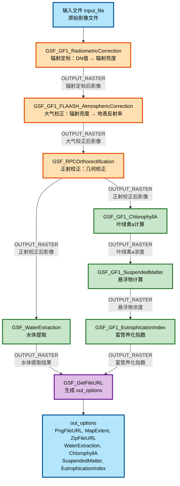

# GSF_WaterEcology_Flow DAG任务调用说明

## 📋 概述

`GSF_WaterEcology_Flow` 是一个ENVI Services Engine (ESE)的DAG（有向无环图）元任务，用于从原始影像到水生态图的自动化处理流程。该流程包含以下步骤：

1. **辐射定标** (GSF_GF1_RadiometricCorrection) - 将DN值转换为辐射亮度
2. **大气校正** (GSF_GF1_FLAASH_AtmosphericCorrection) - 去除大气影响，获取地表反射率
3. **正射校正** (GSF_RPCOrthorectification) - 进行几何校正，消除地形和传感器姿态影响
4. **波段运算-水体提取** (GSF_WaterExtraction) - 提取水体区域
5. **波段运算-叶绿素a计算** (GSF_GF1_ChlorophyllA) - 计算叶绿素a浓度
6. **波段运算-悬浮物计算** (GSF_GF1_SuspendedMatter) - 计算悬浮物浓度
7. **波段运算-富营养化指数** (GSF_GF1_EutrophicationIndex) - 综合评估水体富营养化状况
8. **生成预览和下载** (GSF_GetFileURL) - 生成预览图、ZIP文件等

---

## 🔧 任务配置文件

**文件位置**: `Task/metatasks/GSF_WaterEcology_Flow.task`

**任务类型**: DAG Metatask（元任务）

**服务类型**: JavaScript Service（注意：不是ENVI Service）

---

## 📡 API调用方式

### 1. 基本调用信息

**API端点**:
```
POST http://localhost:9191/ese/services/javascript/GSF_WaterEcology_Flow/submitJob
```

**重要说明**:
- ✅ DAG任务使用 `javascript` 服务，不是 `ENVI` 服务
- ✅ 普通ENVI任务使用: `/ese/services/ENVI/{task}/submitJob`
- ✅ DAG任务使用: `/ese/services/javascript/{task}/submitJob`

### 2. 请求参数

**Content-Type**: `application/json`

**请求体格式** (JSON):

```json
{
  "input_file": "E:/data/GF1_PMS1_xxx.tar.gz",
  "sensor_type": "GF1-PMS",
  "dem_file": "E:/dem/gmted2010.dat",
  "base_file": "",
  "mss_pixel_size": "7.3",
  "pan_pixel_size": "2.0",
  "output_path": "E:/output/",
  "visibility": 40.0,
  "aerosol_model": "Rural",
  "water_threshold": 0.01,
  "water_smooth_size": 5,
  "water_min_area": 0.05,
  "chl_a_algorithm": "Blue-Green Ratio",
  "tsm_algorithm": "Red Band"
}
```

**参数说明**:

| 参数名 | 类型 | 必需 | 说明 |
|--------|------|------|------|
| `input_file` | string | ✅ 是 | 输入文件路径（.tar.gz压缩包或影像文件） |
| `sensor_type` | string | ✅ 是 | 传感器类型（如：GF1-PMS, GF1-WFV等） |
| `dem_file` | string | ❌ 否 | DEM文件路径（可选，默认使用GMTED2010） |
| `base_file` | string | ❌ 否 | 基准文件路径（可选） |
| `mss_pixel_size` | string | ❌ 否 | 多光谱像素大小（米，如"7.3"） |
| `pan_pixel_size` | string | ❌ 否 | 全色像素大小（米，如"2.0"） |
| `output_path` | string | ❌ 否 | 输出文件路径（可选） |
| `visibility` | double | ❌ 否 | 能见度（公里），用于FLAASH大气校正，默认40.0 |
| `aerosol_model` | string | ❌ 否 | 气溶胶模型，可选：No Aerosol, Rural, Maritime, Urban, Tropospheric，默认"Rural" |
| `water_threshold` | double | ❌ 否 | 水体提取阈值，默认0.01 |
| `water_smooth_size` | long | ❌ 否 | 水体平滑核大小，默认5 |
| `water_min_area` | double | ❌ 否 | 最小水体面积（km²），默认0.05 |
| `chl_a_algorithm` | string | ❌ 否 | 叶绿素a算法，可选：Blue-Green Ratio, Three-Band Algorithm，默认"Blue-Green Ratio" |
| `tsm_algorithm` | string | ❌ 否 | 悬浮物算法，可选：Red Band, NIR Band, Red-NIR Ratio，默认"Red Band" |

### 3. 响应格式

**成功响应**:

```json
{
  "jobId": "job_1234567890",
  "jobStatusURL": "ese/jobs/job_1234567890/status"
}
```

**响应字段**:
- `jobId`: 任务ID，用于后续查询任务状态
- `jobStatusURL`: 任务状态查询URL的相对路径

---

## 🔄 任务执行流程

### DAG任务内部流程



### 任务依赖关系

1. **GSF_GF1_RadiometricCorrection** (无依赖)
   - 输入: `input_file` (外部)
   - 输出: `OUTPUT_RASTER` (辐射定标后的影像)

2. **GSF_GF1_FLAASH_AtmosphericCorrection** (依赖: GSF_GF1_RadiometricCorrection)
   - 输入: `GSF_GF1_RadiometricCorrection.OUTPUT_RASTER` (内部)
   - 输入: `visibility`, `aerosol_model` (外部)
   - 输出: `OUTPUT_RASTER` (大气校正后的影像)

3. **GSF_RPCOrthorectification** (依赖: GSF_GF1_FLAASH_AtmosphericCorrection)
   - 输入: `GSF_GF1_FLAASH_AtmosphericCorrection.OUTPUT_RASTER` (内部)
   - 输入: `sensor_type`, `dem_file`, `base_file`, `mss_pixel_size`, `pan_pixel_size` (外部)
   - 输出: `OUTPUT_RASTER` (正射校正后的影像)

4. **GSF_WaterExtraction** (依赖: GSF_RPCOrthorectification)
   - 输入: `GSF_RPCOrthorectification.OUTPUT_RASTER` (内部)
   - 输入: `water_threshold`, `water_smooth_size`, `water_min_area` (外部)
   - 输出: `OUTPUT_RASTER` (水体提取结果)

5. **GSF_GF1_ChlorophyllA** (依赖: GSF_RPCOrthorectification)
   - 输入: `GSF_RPCOrthorectification.OUTPUT_RASTER` (内部)
   - 输入: `chl_a_algorithm` (外部)
   - 输出: `OUTPUT_RASTER` (叶绿素a浓度)

6. **GSF_GF1_SuspendedMatter** (依赖: GSF_RPCOrthorectification)
   - 输入: `GSF_RPCOrthorectification.OUTPUT_RASTER` (内部)
   - 输入: `tsm_algorithm` (外部)
   - 输出: `OUTPUT_RASTER` (悬浮物浓度)

7. **GSF_GF1_EutrophicationIndex** (依赖: GSF_GF1_ChlorophyllA, GSF_GF1_SuspendedMatter)
   - 输入: `GSF_GF1_ChlorophyllA.OUTPUT_RASTER` (内部)
   - 输入: `GSF_GF1_SuspendedMatter.OUTPUT_RASTER` (内部)
   - 输出: `OUTPUT_RASTER` (富营养化指数)

8. **GSF_GetFileURL** (依赖: GSF_WaterExtraction, GSF_GF1_EutrophicationIndex)
   - 输入: `GSF_WaterExtraction.OUTPUT_RASTER` (内部)
   - 输入: `GSF_GF1_ChlorophyllA.OUTPUT_RASTER` (内部)
   - 输入: `GSF_GF1_SuspendedMatter.OUTPUT_RASTER` (内部)
   - 输入: `GSF_GF1_EutrophicationIndex.OUTPUT_RASTER` (内部)
   - 输出: `out_options` (外部)

---

## 💻 前端调用示例

### JavaScript/jQuery调用

```javascript
// 1. 构建任务参数
var params = {
    'input_file': 'E:/data/GF1_PMS1_E113.3_N22.7_20240213_L1A13282365001.tar.gz',
    'sensor_type': 'GF1-PMS',
    'dem_file': 'E:/dem/gmted2010.dat',
    'base_file': '',
    'pan_pixel_size': '2.0',
    'mss_pixel_size': '7.3',
    'output_path': 'E:/output/',
    'visibility': 40.0,
    'aerosol_model': 'Rural',
    'water_threshold': 0.01,
    'water_smooth_size': 5,
    'water_min_area': 0.05,
    'chl_a_algorithm': 'Blue-Green Ratio',
    'tsm_algorithm': 'Red Band'
};

// 2. 调用submitJob函数
function submitJob(task, params, callback, timestamp) {
    var taskUrl;
    if(task == 'GSF_WaterEcology_Flow'){
        // DAG任务使用javascript服务
        taskUrl = "http://localhost:9191/ese/services/javascript/" + task + "/submitJob";
    } else {
        // 普通任务使用ENVI服务
        taskUrl = "http://localhost:9191/ese/services/ENVI/" + task + "/submitJob";
    }
    
    $.post(taskUrl, params, function (data) {
        // 处理响应
        console.log('Job ID:', data.jobId);
        console.log('Status URL:', data.jobStatusURL);
        
        // 开始轮询任务状态
        var statusURL = 'http://localhost:9191/' + data.jobStatusURL;
        poll(statusURL, callback, timestamp);
    });
}

// 3. 调用任务
var timestamp = new Date().getTime();
submitJob('GSF_WaterEcology_Flow', params, function(success, data) {
    if (success) {
        console.log('任务完成！', data);
        // 处理结果
        var pngUrl = data.results[0].value.elements.PngFileURL.dehydratedForm;
        var mapExtent = data.results[0].value.elements.MapExtent.dehydratedForm;
        var zipUrl = data.results[0].value.elements.ZipFileURL.dehydratedForm;
        var waterResult = data.results[0].value.elements.WaterExtraction.dehydratedForm;
        var chlAResult = data.results[0].value.elements.ChlorophyllA.dehydratedForm;
        var tsmResult = data.results[0].value.elements.SuspendedMatter.dehydratedForm;
        var eiResult = data.results[0].value.elements.EutrophicationIndex.dehydratedForm;
    } else {
        console.error('任务失败！', data);
    }
}, timestamp);
```

---

## 📊 任务状态查询

### 查询任务状态

**API端点**:
```
GET http://localhost:9191/ese/jobs/{jobId}/status
```

**示例**:
```javascript
function poll(statusURL, callback, timestamp) {
    $.get(statusURL, function(data) {
        console.log('任务状态:', data.status);
        console.log('进度:', data.progress);
        
        if (data.status === 'COMPLETED') {
            // 任务完成
            callback(true, data);
        } else if (data.status === 'FAILED') {
            // 任务失败
            callback(false, data);
        } else {
            // 任务进行中，继续轮询
            setTimeout(function() {
                poll(statusURL, callback, timestamp);
            }, 2000); // 每2秒查询一次
        }
    });
}
```

**状态值**:
- `JobAccepted`: 任务已接受
- `JobRunning`: 任务运行中
- `COMPLETED`: 任务完成
- `FAILED`: 任务失败
- `CANCELLED`: 任务已取消

---

## 🛠️ 使用cURL调用示例

### 提交任务

```bash
curl -X POST \
  http://localhost:9191/ese/services/javascript/GSF_WaterEcology_Flow/submitJob \
  -H "Content-Type: application/json" \
  -d '{
    "input_file": "E:/data/GF1_PMS1_xxx.tar.gz",
    "sensor_type": "GF1-PMS",
    "dem_file": "E:/dem/gmted2010.dat",
    "mss_pixel_size": "7.3",
    "pan_pixel_size": "2.0",
    "output_path": "E:/output/",
    "visibility": 40.0,
    "aerosol_model": "Rural",
    "water_threshold": 0.01,
    "water_smooth_size": 5,
    "water_min_area": 0.05,
    "chl_a_algorithm": "Blue-Green Ratio",
    "tsm_algorithm": "Red Band"
  }'
```

### 查询任务状态

```bash
curl http://localhost:9191/ese/jobs/job_1234567890/status
```

---

## 📝 输出结果说明

### 成功输出

任务完成后，`out_options` 包含以下信息：

```json
{
  "PngFileURL": "http://localhost:9191/ese/data/xxx.png",
  "MapExtent": {
    "minX": 405000.0,
    "minY": 2520000.0,
    "maxX": 445000.0,
    "maxY": 2560000.0
  },
  "ZipFileURL": "http://localhost:9191/ese/data/xxx.zip",
  "WaterExtraction": {
    "output_file": "E:/output/xxx_water.dat",
    "PngFileURL": "http://localhost:9191/ese/data/xxx_water.png"
  },
  "ChlorophyllA": {
    "output_file": "E:/output/xxx_chla.dat",
    "PngFileURL": "http://localhost:9191/ese/data/xxx_chla.png"
  },
  "SuspendedMatter": {
    "output_file": "E:/output/xxx_tsm.dat",
    "PngFileURL": "http://localhost:9191/ese/data/xxx_tsm.png"
  },
  "EutrophicationIndex": {
    "output_file": "E:/output/xxx_ei.dat",
    "PngFileURL": "http://localhost:9191/ese/data/xxx_ei.png"
  }
}
```

### 输出文件

- **水体提取结果**: `{原文件名}_water.dat`
- **叶绿素a浓度**: `{原文件名}_chla.dat`
- **悬浮物浓度**: `{原文件名}_tsm.dat`
- **富营养化指数**: `{原文件名}_ei.dat`
- **预览图**: PNG格式，用于地图显示
- **ZIP文件**: 包含所有处理结果和元数据

---

## ⚠️ 注意事项

### 1. 服务类型区别

- **DAG任务** (`GSF_WaterEcology_Flow`): 使用 `javascript` 服务
  - URL: `/ese/services/javascript/GSF_WaterEcology_Flow/submitJob`
  
- **普通ENVI任务**: 使用 `ENVI` 服务
  - URL: `/ese/services/ENVI/{task}/submitJob`

### 2. 数据要求

- 输入影像需要包含蓝、绿、红、近红外波段
- 建议使用经过预处理的高质量影像数据
- 确保影像覆盖水体区域

### 3. 参数设置建议

- **能见度**: 根据实际天气条件设置，一般40-50公里
- **气溶胶模型**: 根据研究区域选择，城市区域选择"Urban"，农村区域选择"Rural"
- **水体提取阈值**: 根据影像特点调整，一般0.01-0.05
- **最小水体面积**: 根据研究需求设置，过滤小面积噪声

### 4. 任务执行时间

- DAG任务包含多个子任务，执行时间较长
- 建议设置合理的轮询间隔（2-5秒）
- 大文件处理可能需要数分钟到数小时

### 5. 错误处理

- 检查任务状态返回的错误信息
- 查看ESE服务器日志获取详细错误
- 确保所有依赖任务都已正确配置

---

## 🔍 调试技巧

### 1. 检查任务配置

确保 `GSF_WaterEcology_Flow.task` 文件在正确位置：
```
Task/metatasks/GSF_WaterEcology_Flow.task
```

### 2. 验证子任务

确保所有子任务都已正确注册：
- `GSF_GF1_RadiometricCorrection`
- `GSF_GF1_FLAASH_AtmosphericCorrection`
- `GSF_RPCOrthorectification`
- `GSF_WaterExtraction`
- `GSF_GF1_ChlorophyllA`
- `GSF_GF1_SuspendedMatter`
- `GSF_GF1_EutrophicationIndex`
- `GSF_GetFileURL`

### 3. 查看ESE日志

ESE服务器日志通常位于：
- Windows: `C:\Program Files\Harris\ENVI Services Engine\logs\`
- Linux: `/opt/harris/envi-services-engine/logs/`

### 4. 测试单个任务

在调用DAG任务之前，可以先测试单个子任务是否正常工作。

---

## 📚 相关文档

- [ENVI Services Engine API文档](https://www.nv5geospatialsoftware.com/docs/ENVIServicesEngine.html)
- [DAG任务开发指南](https://www.nv5geospatialsoftware.com/docs/DAGTasks.html)
- [系统运行流程技术文档](./遥感在线系统运行流程技术文档.md)
- [DAG任务调用说明](./DAG任务调用说明.md)

---

**最后更新**: 2024年12月

