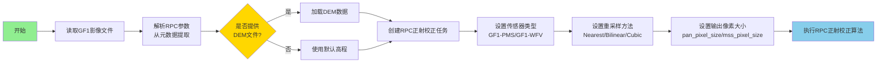
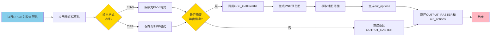
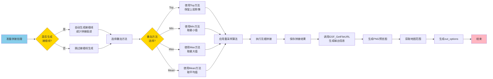

# 12月第二周工作计划（12.8-12.12）

## 项目选择

1. **项目1：GSF_RPCOrthorectification**（GF1数据RPC正射校正）
2. **项目2：GSF_Vegetation_Index**（Landsat植被指数计算）
3. **项目3：GSF_SeamlessMosaic**（多源数据无缝拼接）

---

## 项目功能概述

### 项目1：GSF_RPCOrthorectification

**主要功能**：
- **RPC正射校正**：使用有理多项式系数（RPC）模型对GF1卫星影像（PMS和WFV）进行正射校正，消除地形起伏和传感器姿态引起的几何畸变
- **多传感器支持**：支持GF1-PMS、GF1-WFV等多种传感器类型，也支持GF2、GF4等其他国产卫星
- **重采样算法**：提供三种重采样方法（最近邻、双线性、三次卷积），平衡处理速度与质量
- **DEM辅助**：可选DEM数据辅助校正，提高高海拔地区的校正精度
- **像素大小控制**：可自定义全色和多光谱数据的输出像素大小
- **多格式输出**：支持ENVI和TIFF两种输出格式

**应用场景**：
- GF1卫星影像的几何校正和制图
- 高分辨率影像的正射产品生产
- 与其他影像数据的配准和融合
- 精确测量和地物提取应用

**技术特点**：
- 基于RPC模型的严格几何校正
- 支持多种重采样算法选择
- 可输出标准化的正射影像产品
- 自动生成输出信息（预览图、地图范围等）

---

### 项目2：GSF_Vegetation_Index

**主要功能**：
- **植被指数计算**：对Landsat等多光谱影像计算多种常用植被指数，包括NDVI、EVI、GNDVI、LAI、SAVI、TDVI等
- **多指数支持**：支持归一化植被指数（NDVI）、增强植被指数（EVI）、绿色归一化植被指数（GNDVI）、叶面积指数（LAI）、土壤调整植被指数（SAVI）、变换植被指数（TDVI）
- **通用性**：适用于Landsat系列（Landsat 5/7/8/9）等多光谱卫星数据
- **多格式输出**：支持ENVI和TIFF两种输出格式

**应用场景**：
- Landsat数据的植被监测和分析
- 农业监测和作物长势评估
- 生态环境变化监测
- 森林覆盖度估算
- 植被生产力分析

**技术特点**：
- 基于标准植被指数公式计算
- 支持多种常用植被指数
- 可输出标准化的植被指数产品
- 自动生成输出信息（预览图、地图范围等）

---

### 项目3：GSF_SeamlessMosaic

**主要功能**：
- **无缝拼接**：将GF1、Landsat、GF5等多源卫星影像进行无缝拼接，生成大范围连续影像
- **自动搜索**：自动搜索指定目录中的影像文件，支持ENVI和TIFF格式
- **接缝线生成**：支持自动生成接缝线，减少拼接痕迹
- **多种叠加方法**：提供Top、Min、Max、Mean等多种叠加方法，处理重叠区域
- **重采样支持**：支持多种重采样方法，保证拼接质量

**应用场景**：
- 多景GF1影像的区域拼接
- Landsat数据的区域拼接和制图
- GF5数据的区域拼接
- 多源数据的融合拼接
- 大范围影像产品生产

**技术特点**：
- 自动处理重叠区域
- 支持自动生成接缝线
- 提供多种叠加策略
- 可处理不同格式的影像数据
- 输出无缝拼接结果

---

# 项目1：GSF_RPCOrthorectification

## 第一部分：数据准备与参数设置

### 流程图



### 对应任务说明

**12月8日（周一）- 项目1第1天**

#### 任务总体需求
- 完成GF1数据RPC正射校正任务的核心功能开发
- 实现RPC参数解析和DEM加载功能

#### 任务细分
1. 上午（3小时）
   - 分析GSF_RPCOrthorectification.task参数结构
   - 设计主程序框架和参数验证逻辑
   - 实现GF1影像文件读取和RPC参数解析

2. 下午（4小时）
   - 实现DEM数据加载接口（可选）
   - 实现传感器类型识别（GF1-PMS/GF1-WFV）
   - 实现重采样方法设置功能

#### 完成内容规划
- [ ] 完成.task文件参数定义验证
- [ ] 完成GF1影像读取和RPC参数解析
- [ ] 完成DEM加载功能（可选）
- [ ] 完成传感器类型识别和参数设置
- [ ] 编写单元测试用例

---

## 第二部分：正射校正与结果输出

### 流程图



### 对应任务说明

**12月9日（周二）上午 - 项目1收尾（3小时）**

#### 任务总体需求
- 完成RPC正射校正核心算法和重采样功能
- 实现多格式输出和输出信息生成

#### 任务细分
1. 正射校正实现（1.5小时）
   - 实现RPC正射校正核心算法
   - 实现三种重采样方法（Nearest/Bilinear/Cubic）
   - 实现像素大小设置功能

2. 输出和测试（1.5小时）
   - 实现ENVI/TIFF格式输出
   - 集成GSF_GetFileURL生成输出信息
   - 完善错误处理和测试

#### 完成内容规划
- [ ] 完成RPC正射校正核心算法
- [ ] 完成三种重采样方法实现
- [ ] 完成多格式输出功能
- [ ] 完成输出信息生成集成
- [ ] 完成项目1功能测试和文档

---

# 项目2：GSF_Vegetation_Index

## 第一部分：数据读取与参数配置

### 流程图


### 对应任务说明

**12月9日（周二）下午 - 项目2开始（4小时）**

#### 任务总体需求
- 启动Landsat植被指数计算项目，完成数据读取和参数配置

#### 任务细分
1. 项目分析和设计（2小时）
   - 分析GSF_Vegetation_Index.task结构
   - 设计植被指数计算算法流程
   - 设计多指数支持框架

2. 基础功能实现（2小时）
   - 实现Landsat影像文件读取
   - 实现多光谱波段验证
   - 实现植被指数类型选择功能

#### 完成内容规划
- [ ] 完成项目2需求分析和设计文档
- [ ] 完成Landsat影像读取模块
- [ ] 完成波段验证功能
- [ ] 完成参数配置框架

---

## 第二部分：指数计算与结果输出

### 流程图

```mermaid
flowchart LR
    A[准备植被指数计算] --> B{植被指数<br/>类型?}
    B -->|NDVI| C[计算NDVI<br/>(NIR-Red)/(NIR+Red)]
    B -->|EVI| D[计算EVI<br/>2.5*(NIR-Red)/(NIR+6*Red-7.5*Blue+1)]
    B -->|GNDVI| E[计算GNDVI<br/>(NIR-Green)/(NIR+Green)]
    B -->|LAI| F[计算LAI<br/>基于NDVI转换]
    B -->|SAVI| G[计算SAVI<br/>(NIR-Red)*(1+L)/(NIR+Red+L)]
    B -->|TDVI| H[计算TDVI<br/>1.5*(NIR-Red)/sqrt(NIR²+Red+0.5)]
    C --> I[保存植被指数结果]
    D --> I
    E --> I
    F --> I
    G --> I
    H --> I
    I --> J[调用GSF_GetFileURL<br/>生成输出信息]
    J --> K[生成PNG预览图]
    K --> L[获取地图范围]
    L --> M[生成out_options]
    M --> N[结束]
    
    style A fill:#87CEEB
    style N fill:#FFB6C1
    style B fill:#FFD700
```

### 对应任务说明

**12月10日（周三）- 项目2第2天**

#### 任务总体需求
- 完成多种植被指数计算算法实现
- 实现结果输出和输出信息生成

#### 任务细分
1. 上午（3小时）
   - 实现NDVI、EVI、GNDVI计算算法
   - 实现LAI、SAVI、TDVI计算算法
   - 实现指数值范围验证和异常值处理

2. 下午（4小时）
   - 实现ENVI/TIFF格式输出
   - 集成GSF_GetFileURL生成输出信息
   - 完善错误处理和测试

#### 完成内容规划
- [ ] 完成六种植被指数计算算法
- [ ] 完成指数值验证和异常处理
- [ ] 完成多格式输出功能
- [ ] 完成输出信息生成集成
- [ ] 完成项目2功能测试和优化

---

# 项目3：GSF_SeamlessMosaic

## 第一部分：文件搜索与数据准备

### 流程图


### 对应任务说明

**12月11日（周四）- 项目3第1天**

#### 任务总体需求
- 启动多源数据无缝拼接项目，完成文件搜索和数据准备

#### 任务细分
1. 上午（3小时）
   - 分析GSF_SeamlessMosaic.task复杂参数结构
   - 设计文件搜索和读取架构
   - 实现输入目录扫描和文件搜索

2. 下午（4小时）
   - 实现多源影像文件读取（GF1/Landsat/GF5）
   - 实现空间参考验证和统一
   - 实现重叠区域计算功能

#### 完成内容规划
- [ ] 完成项目3需求分析和架构设计
- [ ] 完成文件搜索和读取功能
- [ ] 完成空间参考验证模块
- [ ] 完成重叠区域计算功能
- [ ] 完成数据准备流程

---

## 第二部分：拼接处理与结果输出

### 流程图



### 对应任务说明

**12月12日（周五）上午 - 项目3收尾（3小时）**

#### 任务总体需求
- 完成接缝线生成、拼接算法和结果输出功能
- 实现完整输出信息生成

#### 任务细分
1. 拼接算法实现（2小时）
   - 实现接缝线自动生成功能
   - 实现四种叠加方法（Top/Min/Max/Mean）
   - 实现重采样和拼接处理

2. 集成测试（1小时）
   - 完成所有功能集成测试
   - 优化代码性能
   - 完善错误处理

#### 完成内容规划
- [ ] 完成接缝线生成功能
- [ ] 完成四种叠加方法实现
- [ ] 完成拼接处理核心算法
- [ ] 完成out_options完整信息生成
- [ ] 完成项目3功能测试

---

# 项目总结

## 12月12日（周五）下午 - 项目总结和文档整理（3小时）

### 任务总体需求
- 整理三个项目的代码和文档，编写总结报告

### 任务细分
1. 代码整理（1.5小时）
   - 代码审查和优化
   - 统一代码风格
   - 添加注释和文档字符串

2. 文档编写（1.5小时）
   - 更新项目文档
   - 编写使用说明
   - 编写总结报告

### 完成内容规划
- [ ] 完成所有项目代码整理
- [ ] 完成项目文档更新
- [ ] 完成使用说明编写
- [ ] 完成工作总结报告
- [ ] 准备项目演示材料

---

## 项目进度总览表

| 日期 | 项目 | 进度 | 主要交付物 |
|------|------|------|-----------|
| 12.8 | 项目1 | 60% | RPC解析、DEM加载、参数设置 |
| 12.9上午 | 项目1 | 100% | 正射校正、多格式输出、测试通过 |
| 12.9下午 | 项目2 | 30% | 数据读取、参数配置 |
| 12.10 | 项目2 | 100% | 植被指数计算、多格式输出 |
| 12.11 | 项目3 | 60% | 文件搜索、数据准备 |
| 12.12上午 | 项目3 | 100% | 拼接算法、测试通过 |
| 12.12下午 | 总结 | - | 文档、报告 |

---

## PPT使用建议

### 1. 每页布局
- **上半部分**：流程图
- **下半部分**：对应任务说明

### 2. 幻灯片结构建议
- **第1页**：封面
- **第2-3页**：项目1（第一部分+第二部分）
- **第4-5页**：项目2（第一部分+第二部分）
- **第6-7页**：项目3（第一部分+第二部分）
- **第8页**：项目进度总览表
- **第9页**：总结

### 3. 流程图截图方法
- 使用Mermaid在线编辑器：https://mermaid.live/
- 或使用支持Mermaid的工具（VS Code、Typora等）
- 导出为PNG格式，分辨率建议300dpi以上
- 确保流程图清晰可读，适合PPT展示

### 4. 注意事项
- 每日开始前回顾前一日进度，调整当日计划
- 每个功能模块完成后进行单元测试
- 遇到技术难点及时记录，统一解决
- 保持代码注释完整，便于后续维护
- 每日结束前提交代码，做好版本控制

---

## 时间分配总览

| 项目 | 总时长 | 分配日期 | 完成度 | 适用数据类型 |
|------|--------|----------|--------|-------------|
| 项目1 | 1.5天 | 12.8全天 + 12.9上午 | 100% | GF1-PMS、GF1-WFV |
| 项目2 | 1.5天 | 12.9下午 + 12.10全天 | 100% | Landsat系列 |
| 项目3 | 1.5天 | 12.11全天 + 12.12上午 | 100% | GF1、Landsat、GF5 |
| 总结 | 0.5天 | 12.12下午 | - | - |
| **总计** | **5天** | **12.8-12.12** | **3个项目** | **多源数据** |

---

## 关键里程碑

- ✅ **12.8结束**：项目1核心功能完成（GF1正射校正）
- ✅ **12.9上午结束**：项目1全部完成
- ✅ **12.9结束**：项目2基础框架完成（Landsat植被指数）
- ✅ **12.10结束**：项目2全部完成
- ✅ **12.11结束**：项目3核心功能完成（多源拼接）
- ✅ **12.12上午结束**：项目3全部完成
- ✅ **12.12结束**：所有项目总结完成

---

## 数据适配说明

### GF1数据
- **适用项目**：项目1（RPC正射校正）
- **传感器类型**：GF1-PMS（全色多光谱）、GF1-WFV（宽幅相机）
- **处理流程**：RPC参数解析 → 正射校正 → 重采样 → 输出

### Landsat数据
- **适用项目**：项目2（植被指数计算）
- **传感器类型**：Landsat 5/7/8/9多光谱数据
- **处理流程**：数据读取 → 波段验证 → 植被指数计算 → 输出

### GF5数据
- **适用项目**：项目3（无缝拼接）
- **处理流程**：文件搜索 → 空间参考统一 → 拼接处理 → 输出

### 多源数据融合
- **适用项目**：项目3（无缝拼接）
- **支持组合**：GF1 + Landsat + GF5 混合拼接
- **处理特点**：自动统一空间参考，处理重叠区域

---

*文档生成时间：2024年12月*
